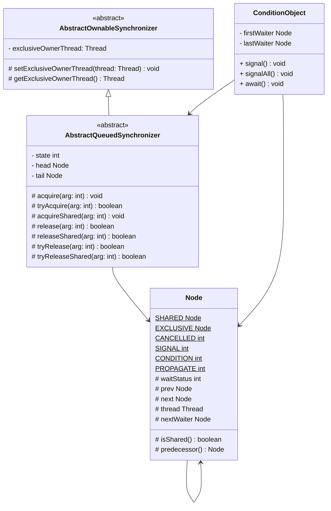
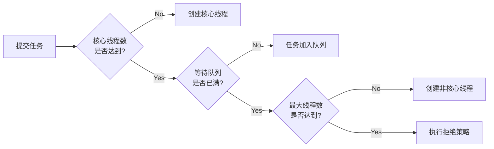

# Java 并发编程之美

[TOC]

## 第一部分 Java 并发编程基础篇

### 第 1 章 并发编程线程基础

**什么是进程？什么是线程？**

> 进程是代码在数据集合上的一次运行活动，是系统进行资源分配和调度的基本单位，线程则是进程的一个执行路径，一个进程中至少有一个线程，进程中的多个线程共享进程的资源。
>
> 操作系统在分配资源时是把资源分配给进程的，但是CPU资源比较特殊，它是被分配到线程的，因为真正要占用CPU运行的是线程，所以也说线程是CPU分配的基本单位。

❓：这里把进程当作是资源分配和调度的基本单位，线程则是 CPU 分配的基本单位。个人对于这个表述存在些许疑问，因为调度应该是指 CPU 调度也就是 CPU 资源分配的过程，把进程当成调度的基本单位应该不合适。

🤔 翻了一下[操作系统](https://weread.qq.com/web/reader/81d32df05a5d7d81deef204?)这本书，调度不仅仅只有 CPU 调度，我之前的理解应该有误，比如针对使用者占用不同资源的调度可以分为：高级调度、中级调度、低级调度，并且作业、进程、线程在不同的时期有不同的含义，尽管如此还是觉得说进程是调度的基本单位这种表述有些模糊。

目前对各种调度的区别不够熟悉，还需要加强操作系统相关概念的学习，这里先暂留个疑问。😐 目前先认为<u>进程是代码在数据集合上的一次运行活动，是系统进行资源分配的基本单位，线程则是进程的一个执行路径，是CPU分配的基本单位，一个进程中至少有一个线程，进程中的多个线程共享进程的资源。</u>


**创建线程的方式**

> Java中有三种线程创建方式，分别为实现Runnable接口的run方法，继承Thread类并重写run的方法，使用FutureTask方式。

个人还是比较倾向 JDK 源码注释中所说的

> There are two ways to create a new thread of execution. One is to declare a class to be a subclass of <code>Thread</code>. This subclass should override the <code>run</code> method of class <code>Thread</code>. An instance of the subclass can then be allocated and started. 
>
> The other way to create a thread is to declare a class that implements the <code>Runnable</code> interface. That class then implements the <code>run</code> method. An instance of the class can then be allocated, passed as an argument when creating <code>Thread</code>, and started. 

创建一个新的执行线程有两种方式：

1. 实现一个 Thread 的子类重写 run 方法；
2. 声明一个类实现 Runnable 接口并实现 run 方法，然后创建 Thread 实例时，将此类的实例作为参数传递。

我觉得这个重点应带不是线程，而是执行，不管是重写子类也还还是实现 Runnable 接口也好，都是实现一个线程任务。Thread 中 run 方法的默认实现是如果 target （Runnable 类型）不为空则调用 target.run()。

总结一下

1. 创建线程的执行任务：上面说的两种
2. 创建 Java 线程：new Thread 或者 new Thread 的子类

3. 创建内核线程 Thread#start0。参考[大家都说Java有三种创建线程的方式！并发编程中的惊天骗局！](https://mp.weixin.qq.com/s/NspUsyhEmKnJ-4OprRFp9g)


**线程通知与等待**

1. **wait 方法**

   三个重载的 wait 的方法签名如下

   ```java
   public final native void wait(long timeout) throws InterruptedException;
   public final native void wait(long timeout, int nanos) throws InterruptedException;
   public final native void wait() throws InterruptedException;
   ```

   以 wait(timeout) 为例进行说明，线程调用对象的 wait 方法后，将被阻塞挂起，直到：

   1. 其他线程调用了该对象的 notify() 或者 notifyAll() 方法；
   2. 其他线程调用了该线程的 interrupt() 方法，使该线程抛出 InterruptedException；
   3. 等待时间超过了 timeout 所指定的毫秒数，如果 timeout = 0 表示没有超时时间。

   其他两个重载函数的作用为：wait() 等同于 wait(0)，wait(long timeout, int nanos) 等同于 wait(nanos > 0 ? timeout + 1: timeout);

   

   **需要注意的是，如果调用 wait() 方法的线程没有事先获取该对象的监视器锁，则调用 wait() 方法时调用线程会抛出IllegalMonitorStateException异常。**

   **一个线程如何获取一个共享变量的监视器锁呢？**

   1. 执行synchronized同步代码块时，使用该共享变量作为参数。
   2. 调用该共享变量的方法，并且该方法使用了synchronized修饰。

   **什么是虚假唤醒？**

   当一个线程在等待某个条件满足时（例如，通过`wait()`方法等待），在某些情况下，该线程可能会在条件未满足的情况下被唤醒。这种情况被称为虚假唤醒。

   **如何避免虚假唤醒？**

   通过在 while 循环中调用 wait 方法进行处理。

   ```java
   synchronized (lock) {
       while (!condition) { // 检查条件是否满足
           try {
               lock.wait(); // 如果条件未满足，则等待
           } catch (InterruptedException e) {
               // 处理中断异常
           }
       }
       // 条件满足，执行相应操作
   }
   ```

2. **notify / notifyAll 方法**

   线程调用共享对象的 notify() 方法后，会唤醒一个在该共享变量上调用 wait 系列方法后被挂起的线程，一个共享变量上可能会有多个线程在等待，具体唤醒哪个等待的线程是随机的。而 notifyAll() 方法则会唤醒所有在该共享变量上由于调用 wait 系列方法而被挂起的线程。

   此外，被唤醒的线程不能马上从 wait 方法返回并继续执行，它必须在获取了共享对象的监视器锁后才可以返回，也就是唤醒它的线程释放了共享变量上的监视器锁后，被唤醒的线程也不一定会获取到共享对象的监视器锁，这是因为该线程还需要和其他线程一起竞争该锁，只有该线程竞争到了共享变量的监视器锁后才可以继续执行。


**Thread#join 方法：等待线程执行终止**

三个重载的 join 的方法签名如下

```java
public final synchronized void join(long millis) throws InterruptedException;
public final synchronized void join(long millis, int nanos) throws InterruptedException;
public final void join() throws InterruptedException;
```

join 方法通过 synchronized 修饰，然后内部调用循环调用 Thread 对象的 wait 方法实现直到 Thread 对象所代表的线程死了，线程终止后会调用 Thread 对象的 notifyAll() 唤醒所有因调用 wait 方法而阻塞的线程，而线程因为调用 interrupt 被中断后 join 方法会抛出 InterruptedException 而返回（源自 wait）。

join(millis, nanos) 等同于 join(nanos >= 500000 || (nanos != 0 && millis == 0) ? ++millis : millis) 。

join() 等同于 join(0)。

所以，join 方法其实就是通过对 Thread 对象加锁，然后调用 wait 阻塞当前线程直至。


**Thread.sleep 方法：让线程睡眠**

Thread类中有一个静态的sleep方法，当一个执行中的线程调用了Thread的sleep方法后，调用线程会暂时让出指定时间的执行权，也就是在这期间不参与CPU的调度，但是该线程所拥有的监视器资源，比如锁还是持有不让出的。指定的睡眠时间到了后该函数会正常返回，线程就处于就绪状态，然后参与CPU的调度，获取到CPU资源后就可以继续运行了。如果在睡眠期间其他线程调用了该线程的interrupt（）方法中断了该线程，则该线程会在调用sleep方法的地方抛出InterruptedException异常而返回。


**Thread.yield 方法：让出 CPU 执行权**

yield 方法是 Thread 类中的一个静态方法，当一个线程调用 yield 时，是在暗示自己可以交出 CPU 使用权，但是线程调度器可以无条件忽略这个暗示。线程调用 yield 方法后，当前线程让出 CPU 使用权，然后处于就绪状态，线程调度器会从线程就绪队列里面获取一个线程优先级最高的线程，当然也有可能会调度到刚刚让出 CPU 的线程来获取 CPU 执行权。


**线程中断**

> 换个说法可能比较合适，Java 线程对象的中断标志。

Java中的线程中断是一种线程间的协作模式，通过设置线程的中断标志并不能直接终止该线程的执行，而是被中断的线程根据中断状态自行处理。

- interrupt 方法：Thread 类的实例方法，作用是中断线程，但是并不是真的中断线程，而是设置标志位。如果线程被调用了 interrupt 方法，线程因为调用了 wait 系列函数、join 方法或者 sleep 方法而被阻塞挂起的地方会抛出 Interrupted Exception 异常而返回。
- isInterrupted 方法：Thread 类的实例方法，检测线程是否被中断。
- interrupted 方法：Thread 类的静态方法，检测当前执行线程是否被中断，与 isInterrupted 不同的是，如果发现当前执行线程被中断，会将标志位清楚，也就是说变成非中断了。


**线程上下文切换**

线程上下文切换时机：

1. 线程正常执行完毕。
2. 线程未执行完，但是时间片用完。
3. 被其他线程打断。
4. 因为 I/O 之类的阻塞挂起。
5. 并发抢占锁或者资源时，线程没有抢到。
6. 代码致使线程挂起。例如sleep、join、wait方法的调用。


**线程死锁**

死锁是指两个或两个以上的线程在执行过程中，因争夺资源而造成的互相等待的现象。

<u>死锁产生的四个必要条件：互斥、请求并保持、非抢占、循环等待。</u>

死锁避免：破坏死锁的四个必要条件之一。


**守护线程和用户线程**

可以通过 Thread#setDaemon 方法传入 true 来将线程设置为守护线程。

守护线程与用户线程的区别是，当最后一个非守护线程结束时，JVM会正常退出，而不管当前是否有守护线程，也就是说守护线程是否结束并不影响JVM的退出。言外之意，只要有一个用户线程还没结束，正常情况下JVM就不会退出。


### 第 2 章 并发编程的其他基础知识

**Java 中的线程安全问题**

共享资源：被多个线程所持有或者说多个线程都可以去访问的资源。

线程安全问题是指当多个线程同时读写一个共享资源并且没有任何同步措施时，导致出现脏数据或者其他不可预见的结果的问题。


**伪共享**

为了解决计算机系统中主内存与CPU之间运行速度差问题，会在CPU与主内存之间添加一级或者多级高速缓冲存储器（Cache）。在 Cache 内部是按行存储的，其中每一行成为一个 Cache 行。Cache 行是 Cache 与主内存进行数据交换的单位，而一个 Cache 行可以存储多个变量。因此当多个线程同时修改一个缓存行里面的多个变量时，由于同时只能有一个线程操作缓存行，相比将每个变量放到一个缓存行，性能会有所下降，这就是伪共享。

如何避免伪共享？

- 在 JDK 8 之前一般都是通过字节填充的方式来避免该问题，也就是创建一个变量时使用填充字段填充该变量所在的缓存行，这样就避免了将多个变量存放在同一个缓存行中，

- JDK 8提供了一个sun.misc.Contended注解，用来解决伪共享问题。

  在默认情况下，@Contended注解只用于Java核心类，比如rt包下的类。如果用户类路径下的类需要使用这个注解，则需要添加JVM参数：-XX:-RestrictContended。填充的宽度默认为128，要自定义宽度则可以设置-XX:ContendedPaddingWidth参数。


**锁的概述**

1. 乐观锁与悲观锁
2. 公平锁与非公平锁
3. 独占锁和共享锁
4. 可重入锁
5. 自旋锁


## 第二部分 Java 并发编程高级篇

### 第 3 章 Java 并发包中 ThreadLocalRandom 原理剖析

**Random 类及其局限性**

> Math.random 使用的也是 Random 类。

使用 Random 生成随机数的需要种子，种子可以通过构造函数指定，如果不指定则会自动生成一个。

Random 生成随机数主要是两个步骤：

1. 根据老的种子来生成新的种子。
2. 根据新的种子来计算新的随机数。

在多线程场景下可能发生的问题：

1. 构造的多个 Random 实例，在未指定种子的情况下，内部生成的默认种子相同。
2. 使用同一个 Random 类，可能导致多个线程产生的新的种子是一样的。

对于问题 1，在 JDK 中使用如下代码解决：

```java
public Random() {
    this(seedUniquifier() ^ System.nanoTime());
}

private static long seedUniquifier() {
    // L'Ecuyer, "Tables of Linear Congruential Generators of
    // Different Sizes and Good Lattice Structure", 1999
    for (;;) {
        long current = seedUniquifier.get();
        long next = current * 181783497276652981L;
        if (seedUniquifier.compareAndSet(current, next))
            return next;
    }
}
```

对于问题 2，使用如下代码解决：

```java
protected int next(int bits) {
    long oldseed, nextseed;
    AtomicLong seed = this.seed;
    do {
        oldseed = seed.get();
        nextseed = (oldseed * multiplier + addend) & mask;
    } while (!seed.compareAndSet(oldseed, nextseed));
    return (int)(nextseed >>> (48 - bits));
}
```

总结来说就是通过 CAS + 自旋操作来保证多线程下随机数的随机性。但是这样当多个线程竞争同一个原子变量的更新操作，由于 CAS 只有一个线程会成功，会出现大量的自旋重试，这会降低并发性能。

**ThreadLocalRandom**

ThreadLocalRandom 为了避免多个线程对同一个原子变量的竞争操作，使用的是每个线程维护一个自己的种子变量的方式。

ThreadLocalRandom 是 <u>Random 的子类并且是一个饿汉式单例类</u>，通过 current 可以获取到实例对象。在初次调用 current 时会判断种子是否初始化，如果没有则会进行初始化。相关代码如下：

```java
static final void localInit() {
    int p = probeGenerator.addAndGet(PROBE_INCREMENT);
    int probe = (p == 0) ? 1 : p; // skip 0
    long seed = mix64(seeder.getAndAdd(SEEDER_INCREMENT));
    Thread t = Thread.currentThread();
    UNSAFE.putLong(t, SEED, seed);
    UNSAFE.putInt(t, PROBE, probe);
}

public static ThreadLocalRandom current() {
    if (UNSAFE.getInt(Thread.currentThread(), PROBE) == 0)
        localInit();
    return instance;
}
```

probeGenerator 和 seeder 是两个原子变量，用来为每个线程生成 threadLocalRandomProbe 和 threadLocalRandomSeed 这两个属性的值。这样对于原子变量更新的竞争只会出现在线程第一次调用 current 获取实例时，后续生成随机数并不会发生。

### 第 4 章 Java 并发包中原子操作类原理剖析

JUC 并发包中包含的 AtomicInteger、AtomicLong 和 AtomicBoolean 等原子性操作类，它们的原理类似，其内部使用Unsafe来实现（CAS + 自旋（看具体操作））。

这类原子类，通过 CAS 提供了非阻塞的原子性操作，但是在高并发下大量线程会同时去竞争更新同一个原子变量，因为同时只能有一个线程操作成功，这会造成了大量线程竞争失败而通过无限循环进行自旋，这会浪费 CPU 资源。

为了解决这个问题，提高性能，LongAdder 内部会有一个变量 cells （类型为 Cell 数组）用来将更新操作分散到多个 cell 上。当线程执行操作时，会随机找一个 cell 进行操作，如果发生冲突会继续寻找下一个没有冲突的 cell 进行操作或者扩容 cells 数组。

### 第 5 章 Java 并发包中并发 List 源码剖析

CopyOnWriteArrayList 是一个线程安全的 List，内部通过 ReentrantLock 来保证同时只有一个线程对 array 变量进行修改，并且对 array 进行修改时会使用写时复制的策略，保证其他线程的读取是安全的，适用于读多写少的场景。

### 第 6 章 Java 并发包中锁原理剖析

**抽象同步队列 AQS**

AbstractQueuedSynchronizer 抽象同步队列简称 AQS，它是实现同步器的基础组件，并发包中锁的底层就是使用 AQS 实现的。

AQS 类图如下：



AQS 是一个 FIFO 的双向队列，在内部通过 head 和 tail 记录队首和队尾元素，队列元素类型为 Node。state 用来表示 AQS 的状态，在不同的实现中有不同的含义。通过 exclusiveOwnerThread 变量来记录持有锁的线程，来实现线程互斥和重入。

在 Node 中通过 thread 变量来存放进入 AQS 队列里面的线程，Node 节点内部的 SHARED 用来标记该线程是获取共享资源时被阻塞挂起后放入 AQS 对立的，EXCLUSIVE 用来标记线程是获取独占资源时被挂起后放入 AQS 队列的；waitStatus 记录当前线程等待状态，可以为 CANCELLED（当前线程被取消了）、SIGNAL（后继线程需要被唤醒）、CONDITION（表示线程正在 Condition 中等待）、PROPAGATE（释放共享资源时需要通知其他节点），prev 记录当前节点在 AQS 中的前驱，next 记录当前节点在 AQS 中的后继，nextWaiter 用于记录在 ConditionObject 链表中当前元素的后继。

ConditionObject 也通过 Node 实现了一个单向链表，firstWaiter 指向队首，lastWaiter 指向队尾，通过 Node 中的 nextWaiter 用于记录当前元素的后继。通过调用 await 方法会将当前线程加入队列，调用 signal 将队首元素或者调用 signalAll 将所有元素加入到 AQS 队列中。

加入 AQS 队列的线程首先是处于运行状态，而在 AQS 中只有队首元素会尝试获取 state，如果获取失败或者非队首元素都会将前一个节点的状态置为 SIGNAL 然后调用 LockSupport.park 阻塞当前线程。当线程释放 state 时，会唤醒 head 节点指向的后继节点。

**独占锁 ReentrantLock**

ReentrantLock 是一个可重入的独占锁，同时只有一个线程可以获取锁，其他获取锁的线程会被阻塞而放入该锁的 AQS 队列中。

ReentrantLock 内部通过继承 AQS 实现了一个 Sync 类，其有 NonfairSync 和 FairSync 两个子类分别实现非公平锁和公平锁。

在这里 AQS 中的 state 用来表示线程获取锁的重入次数，默认情况下，state 值为 0 表示当前锁没有被任何线程持有。当线程获取锁或者重入时都是将 state 加 1，当线程释放锁时对 state 减 1，当 state 为 0 后表示当前线程释放了该锁。内部通过 AQS 的 exclusiveOwnerThread 变量记录获取锁的线程。

获取锁：

1. lock() 方法，获取锁，如果获取成功会将 state 加 1，获取失败则会加入 AQS 等待队列中然后阻塞。
2. lockInterruptibly() 方法，和 lock() 方法不同在于，如果线程中断标志为 true 会抛出 InterruptedException 异常。
3. tryLock() 方法，尝试获取锁，使用的是非公平获取，如果索取到锁返回 true，否则返回 false，该方法不会引起当前线程阻塞。
4. tryLock(long timeout, TimeUnit unit) 方法，与 tryLock 不同在于设置了超时时间，如果超时时间到没有获取到锁则返回 false。在具体实现中如果第一次获取锁失败之后会加入 AQS 队列等待，利用 LockSupport.parkNanos 阻塞指定时间后还没有获取到锁，会将等待状态设置为取消，然后从等待队列中移除。

释放锁：

1. unlock() 方法，如果当前线程持有锁，调用该方法会让 AQS state 减 1，如果减 1 之后 state 为 0，会释放锁（将 exclusiveOwnerThread 设置为 null，并唤醒等待队列中第一个线程）。

**读写锁 ReentrantReadWriteLock**

ReentrantLock 是独占锁，某时只有一个线程可以获取该锁，而实际中会有写少读多的场景，显然 ReentrantLock 满足不了这个需求，所以 ReentrantReadWriteLock 应运而生。ReentrantReadWriteLock 采用读写分离的策略，允许多个线程可以同时获取读锁。

ReentrantReadWriteLock 内部 ReadLock 和 WriteLock 两种锁，共用一个 Sync 实例。Sync 是 AQS 的子类，通过 state 的高 16 位表示获取读锁的次数，使用低 16 位表示写锁的重入次数。因此读写锁的获取次数最多为 2^16，超过这个数量会报错。

ReentrantReadWriteLock 的加锁和释放锁的过程与 ReentrantLock 有些类似，只不过 ReentrantReadWriteLock 中的读锁是共享锁，写锁是独占锁。

**StampedLock**

StampedLock 提供的读写锁与 ReentrantReadWriteLock 类似，只是前者提供的是不可重入锁。但是前者通过提供乐观读锁在多线程多读的情况下提供了更好的性能，这是因为获取乐观读锁时不需要进行CAS操作设置锁的状态，而只是简单地测试状态。

StampedLock 不是基于 AQS 实现的。

### 第 7 章 Java 并发包中的并发队列原理剖析

略

### 第 8 章 Java 并发包中线程池 ThreadPoolExecutor 原理探究

线程池主要解决两个问题：

1. 执行大量异步任务时提供较好的性能。线程池中的线程是可复用的，不需要每次执行异步任务时都重新创建和销毁线程。
2. 提供资源限制和管理的手段，比如限制线程的个数，动态增加线程等。

**要点：**

1. 使用 AtomicInteger 的高 3 位用来表示线程池状态，后 29 位用来记录线程池线程个数。

2. 线程池状态：

   1. running：接受新任务并处理阻塞队列里的任务。
   2. shutdown：拒绝新任务但是处理阻塞队列里的任务。
   3. stop：拒绝新任务并且抛弃队列里的任务，同时会中断正在处理的任务。
   4. tidying：所有任务都执行玩（包含阻塞队列里面的任务）后当前线程池活动线程数为 0，将要调用 terminated 方法。
   5. terminated：终止状态。terminated 方法调用完成以后的状态。

   状态转换过程：

   ```mermaid
   stateDiagram
       [*] --> running
       running --> shutdown: 调用 shutdown()
       shutdown --> stop: 调用 shutdownNow()
       running --> stop: 调用 shutdownNow()
       shutdown --> tidying: 线程池和任务队列都为空
       stop --> tidying: 线程池为空
       tidying --> terminated: terminated() 执行完成
       terminated --> [*]
   ```

3. 线程池参数：

   1. corePoolSize：核心线程数
   2. maximunPoolSize：最大线程数
   3. keepAliveTime：非核心线程数空闲时的最大存活时间
   4. unit：存活时间的时间单位
   5. workQueue：任务队列
   6. threadFactory：线程工厂
   7. handler：拒绝策略（AbortPolicy（抛出异常）、CallerRunsPolicy（使用调用者所在线程来运行任务）、DiscardOldestPolicy（调用poll丢弃一个任务，执行当前任务）及 DiscardPolicy）

常见的线程池类型：

-  FixedThreadPool ：核心线程线程数等于最大线程数（由参数指定），阻塞队列长度为 Integer.MAX_VALUE。
- SingleThreadExecutor：核心线程线程数等于最大线程数且为 1，阻塞队列长度为 Integer.MAX_VALUE。
- CachedThreadPool：核心线程数为 0，最大线程数为  Integer.MAX_VALUE，keeyAliveTime = 60s，阻塞队列为同步队列长度为 1。

**线程池任务提交流程：**



### 第 9 章 Java 并发包中 ScheduledThreadPoolExecutor 原理探究

ScheduledThreadPoolExecutor 是一个可以在指定一定延迟时间后或者定时进行任务调度执行的线程池。

ScheduledFutureTask 内部还有一个变量 period 用来表示任务的类型，任务类型如下：

- period = 0，说明当前任务是一次性的，执行完毕后就退出了。
- period 为负数，说明当前任务为 fixed-delay 任务，是固定延迟的定时可重复执行任务。
- period 为正数，说明当前任务为 fixed-rate 任务，是固定频率的定时可重复执行任务。

三个重要函数

- schedule（Runnable command, long delay, TimeUnit unit）

  提交一个延迟执行的任务，任务从提交时间开始延迟以 unit 为单位的 delay 时间后开始执行，提交的任务只会执行一次。

- scheduleWithFixedDelay（Runnable command, long initialDelay, long delay, TimeUnit unit）

  该方法的作用是，当任务执行完毕后，让其延迟固定时间后再次运行（fixed-delay任务）。

- scheduleAtFixedRate（Runnable command, long initialDelay, long period, TimeUnit unit）

  该方法相对起始时间点以固定频率调用指定的任务（fixed-rate任务）。当把任务提交到线程池并延迟 initialDelay 时间（时间单位为unit）后开始执行任务 command，然后每隔 period 时间就会执行一次。

<u>需要注意的是，因为任务的下一次执行时间是任务执行完成之后设置的，对于 fixed-rate 任务如果当前任务还没有执行完，下一次要执行任务的时间到了，也不会并发执行，而是要等到当前任务执行完毕后再执行。</u>

### 第 10 章 Java 并发包中线程同步器原理剖析

**CountDownLatch**

CountDownLatch 通过 AQS 实现的，利用 AQS 的 state 表示计数器的值。

1. await 方法

   调用 CountDownLatch 的 await 方法后，当前线程会被阻塞，直到下面情况发生才会返回：1. 通过调用 countDown 方法，使得 state 的值为 0；2. 其他线程调用了当前线程的 interrupt() 方法中断了当前线程，当前线程就会抛出 Interrupted Exception 异常，然后返回。

2. countDown 方法

   调用该方法，递减 state 的值，递减后如果 state 为 0 则唤醒所有因为调用 await 方法而阻塞的线程，否则什么也不做。

> 注意 CountDownLatch 只能使用一次，不能循环使用。

**CyclicBarrier**

CyclicBarrier 让一组线程全部达到一个状态后再全部同时执行，CyclicBarrier 是可以重复使用的。CyclicBarrier 是基于 ReentrantLock 实现的。

为了保证可以重复使用，维护了 parties 和 count 两个变量，parties 表示线程个数，count 一开始等于 parties，每当线程调用 await 方法就递减 1，当 count 为 0 时就表示所有线程都到了屏障点。

await 方法

调用 await 方法的线程会被阻塞，直到满足以下条件之一：1. parties 个线程都调用了 await 方法；2. 其他线程调用了当前线程的 interrupt 方法中断了当前线程，当前线程会抛出 Interrupted Exception 异常而返回；3. 与当前屏障点关联的 Generation 对象的 broken 标志被设置为 true 时，会抛出 BrokenBarrierException 异常，然后返回。

在 await 方法中通过 ReentrantLock 实现对 count 对互斥修改，当 count 不为 0 时会调用 Condition 的 await 方法进行阻塞，当 count 等于 0 时，会重置 count 为 parties，并唤醒所有的等待线程。

**Semaphore**

Semaphore 信号量也是 Java 中的一个同步器，也是利用 AQS 的 state 实现计数器。

1. acquire()

   调用该方法的目的是希望获取一个信号量资源，如果信号量数量为 0，则当前线程会被放入 AQS 的阻塞队列中。

2. acquire(int permits)

   该方法与 acquire() 的区别在于，该方法需要获取 permits 个信号量。

3. release()

   释放一个信号量，然后根据公平策略唤醒阻塞队列中第一个线程，被唤醒的线程会尝试获取信号量。

4. release(int permits)

   释放 permits 个信号量。

## 第三部分 Java 并发编程实践篇

### 第 11 章 并发编程实践

略
