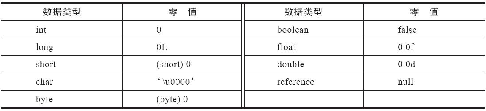

[TOC]

# 第 6 章 类文件结构

## Class 类文件的结构

> **注意**：任何一个Class文件都对应着唯一的一个类或接口的定义信息，但是反过来说，类或接口并不一定都得定义在文件里（譬如类或接口也可以动态生成，直接送入类加载器中）。

**Class 文件是一组以 8 个字节为基础单位的二进制流**，各个数据项目严格按照顺序紧凑地排列在文件之中，中间没有添加任何分隔符，这使得整个Class文件中存储的内容几乎全部是程序运行的必要数据，没有空隙存在。当遇到需要占用8个字节以上空间的数据项时，则会按照高位在前的方式分割成若干个8个字节进行存储。

## 字节码指令简介

Java虚拟机指令集所支持的数据类型

# 第 7 章 虚拟机类加载机制

## 类加载的时机

类的生命周期：

> 加载、验证、准备、初始化和卸载这五个阶段的顺序是确定的，类型的加载过程必须按照这种顺序按部就班地开始，而**解析阶段则不一定**：它在某些情况下可以在初始化阶段之后再开始，这是为了支持Java语言的运行时绑定特性（也称为动态绑定或晚期绑定）。请注意，这里笔者写的是按部就班地“开始”，而不是按部就班地“进行”或按部就班地“完成”，强调这点是因为这些阶段通常都是互相交叉地混合进行的，会在一个阶段执行的过程中调用、激活另一个阶段。

《Java 虚拟机规范》规定有且只有六种情况必须立即对类进行“初始化”：

1. 遇到new、getstatic、putstatic 或 invokestatic 这四条字节码指令时，如果类型没有进行过初始化，则需要先触发其初始化阶段。能够生成这四条指令的典型Java代码场景有：
   - 使用new关键字实例化对象的时候。
   - 读取或设置一个类型的静态字段（被final修饰、已在编译期把结果放入常量池的静态字段除外）的时候。
   - 调用一个类型的静态方法的时候。
2. 使用 java.lang.reflect 包的方法对类型进行反射调用的时候，如果类型没有进行过初始化，则需要先触发其初始化。
3. 当初始化类的时候，如果发现其父类还没有进行过初始化，则需要先触发其父类的初始化。
4. 当虚拟机启动时，用户需要指定一个要执行的主类（包含main()方法的那个类），虚拟机会先初始化这个主类。
5. 当使用JDK 7新加入的动态语言支持时，如果一个java.lang.invoke.MethodHandle实例最后的解析结果为REF_getStatic、REF_putStatic、REF_invokeStatic、REF_newInvokeSpecial四种类型的方法句柄，并且这个方法句柄对应的类没有进行过初始化，则需要先触发其初始化。
6. 当一个接口中定义了JDK 8新加入的默认方法（被default关键字修饰的接口方法）时，如果有这个接口的实现类发生了初始化，那该接口要在其之前被初始化。

对于这六种会触发类型进行初始化的场景，《Java虚拟机规范》中使用了一个非常强烈的限定语——“有且只有”，这六种场景中的行为称为**对一个类型进行主动引用**。除此之外，所有引用类型的方式都不会触发初始化，称为被动引用。

## 类加载的过程

### 加载

加载阶段，Java虚拟机需要完成以下三件事情：

1. 通过一个类的全限定名来获取定义此类的二进制字节流。
2. 将这个字节流所代表的静态存储结构转化为方法区的运行时数据结构。
3. 在内存中生成一个代表这个类的java.lang.Class对象，作为方法区这个类的各种数据的访问入口。

而对于数组类而言，其本身不通过类加载器创建，它是由 Java 虚拟机直接在内存中动态构造出来的。但数组类与类加载器仍然有很密切的关系，因为数组类的元素类型（Element Type，指的是数组去掉所有维度的类型）最终还是要靠类加载器来完成加载，一个数组类（下面简称为C）创建过程遵循以下规则：

- 如果数组的组件类型（Component Type，指的是数组去掉一个维度的类型，注意和前面的元素类型区分开来）是引用类型，那就递归采用本节中定义的加载过程去加载这个组件类型，数组C将被标识在加载该组件类型的类加载器的类名称空间上（这点很重要，一个类型必须与类加载器一起确定唯一性）。
- 如果数组的组件类型不是引用类型（例如int[]数组的组件类型为int），Java虚拟机将会把数组C标记为与引导类加载器关联。
- 数组类的可访问性与它的组件类型的可访问性一致，如果组件类型不是引用类型，它的数组类的可访问性将默认为public，可被所有的类和接口访问到。

### 验证

验证是连接阶段的第一步，这一阶段的目的是**确保Class文件的字节流中包含的信息符合《Java虚拟机规范》的全部约束要求**，保证这些信息被当作代码运行后不会危害虚拟机自身的安全。

验证阶段大致上会完成下面四个阶段的检验动作：文件格式验证、元数据验证、字节码验证和符号引用验证。

1. **文件格式验证**

   **验证字节流是否符合Class文件格式的规范，并且能被当前版本的虚拟机处理。**

   包括下面这些验证点：

   - 是否以魔数0xCAFEBABE开头。
   - 主、次版本号是否在当前Java虚拟机接受范围之内。
   - 常量池的常量中是否有不被支持的常量类型（检查常量tag标志）。
   - 指向常量的各种索引值中是否有指向不存在的常量或不符合类型的常量。
   - CONSTANT_Utf8_info型的常量中是否有不符合UTF-8编码的数据。
   - Class文件中各个部分及文件本身是否有被删除的或附加的其他信息。
   - ……

2. **元数据验证**

   **对字节码描述的信息进行语义分析，以保证其描述的信息符合《Java语言规范》的要求。**

   包括的验证点如下：

   - 这个类是否有父类（除了java.lang.Object之外，所有的类都应当有父类）。
   - 这个类的父类是否继承了不允许被继承的类（被final修饰的类）。
   - 如果这个类不是抽象类，是否实现了其父类或接口之中要求实现的所有方法。
   - 类中的字段、方法是否与父类产生矛盾（例如覆盖了父类的final字段，或者出现不符合规则的方法重载，例如方法参数都一致，但返回值类型却不同等）。
   - ……

3. **字节码验证**

   **通过数据流分析和控制流分析，确定程序语义是合法的、符合逻辑的。**

   对类的方法体（Class文件中的Code属性）进行校验分析，保证被校验类的方法在运行时不会做出危害虚拟机安全的行为，例如：

   - 保证任意时刻操作数栈的数据类型与指令代码序列都能配合工作，例如不会出现类似于“在操作栈放置了一个int类型的数据，使用时却按long类型来加载入本地变量表中”这样的情况。
   - 保证任何跳转指令都不会跳转到方法体以外的字节码指令上。
   - 保证方法体中的类型转换总是有效的，例如可以把一个子类对象赋值给父类数据类型，这是安全的，但是把父类对象赋值给子类数据类型，甚至把对象赋值给与它毫无继承关系、完全不相干的一个数据类型，则是危险和不合法的。
   - ……

4. **符号引用验证**

   符号引用验证的校验行为发生在虚拟机将符号引用转化为直接引用的时候，这个转化动作将在连接的解析阶段中发生。

   符号引用验证可以看作是对类自身以外（常量池中的各种符号引用）的各类信息进行匹配性校验，通俗来说就是，该类是否缺少或者被禁止访问它依赖的某些外部类、方法、字段等资源。本阶段通常需要校验下列内容：

   - 符号引用中通过字符串描述的全限定名是否能找到对应的类。
   - 在指定类中是否存在符合方法的字段描述符及简单名称所描述的方法和字段。
   - 符号引用中的类、字段、方法的可访问性(private、protected、public、<package>)是否可被当前类访问。
   - ……

   **符号引用验证的主要目的是确保解析行为能正常执行**，如果无法通过符号引用验证，Java虚拟机将会抛出一个java.lang.IncompatibleClassChangeError的子类异常，典型的如：java.lang.IllegalAccessError、java.lang.NoSuchFieldError、java.lang.NoSuchMethodError等。

### 准备

**准备阶段是正式为类中定义的变量（即静态变量，被static修饰的变量）分配内存并设置类变量初始值的阶段**，从概念上讲，这些变量所使用的内存都应当在方法区中进行分配，但必须注意到方法区本身是一个逻辑上的区域，在JDK 7及之前，HotSpot使用永久代来实现方法区时，实现是完全符合这种逻辑概念的；而在JDK 8及之后，类变量则会随着Class对象一起存放在Java堆中，这时候“类变量在方法区”就完全是一种对逻辑概念的表述了。

关于准备阶段，还有两个容易产生混淆的概念笔者需要着重强调，首先是这时候进行内存分配的仅包括类变量，而不包括实例变量，实例变量将会在对象实例化时随着对象一起分配在Java堆中。其次是这里所说的初始值“通常情况”下是数据类型的零值，假设一个类变量的定义为：`public static int value = 123;`

那变量value在准备阶段过后的初始值为0而不是123，因为这时尚未开始执行任何Java方法，而把value赋值为123的putstatic指令是程序被编译后，存放于类构造器\<clinit>()方法之中，所以把value赋值为123的动作要到类的初始化阶段才会被执行。

上面提到在“通常情况”下初始值是零值，那言外之意是相对的会有某些“特殊情况”：如果类字段的字段属性表中存在ConstantValue属性，那在准备阶段变量值就会被初始化为ConstantValue属性所指定的初始值，假设上面类变量value的定义修改为：`public static final int value = 123;`

编译时Javac将会为value生成ConstantValue属性，在准备阶段虚拟机就会根据Con-stantValue的设置将value赋值为123。

### 解析

解析阶段是 Java 虚拟机**将常量池内的符号引用替换为直接引用的过程**。

- **符号引用(Symbolic References)**：符号引用以一组符号来描述所引用的目标，符号可以是任何形式的字面量，只要使用时能无歧义地定位到目标即可。符号引用与虚拟机实现的内存布局无关，引用的目标并不一定是已经加载到虚拟机内存当中的内容。各种虚拟机实现的内存布局可以各不相同，但是它们能接受的符号引用必须都是一致的，因为符号引用的字面量形式明确定义在《Java虚拟机规范》的Class文件格式中。
- **直接引用(Direct References)**：直接引用是可以直接指向目标的指针、相对偏移量或者是一个能间接定位到目标的句柄。直接引用是和虚拟机实现的内存布局直接相关的，同一个符号引用在不同虚拟机实例上翻译出来的直接引用一般不会相同。如果有了直接引用，那引用的目标必定已经在虚拟机的内存中存在。

### 初始化

类的初始化阶段是类加载过程的最后一个步骤，之前介绍的几个类加载的动作里，除了在加载阶段用户应用程序可以通过自定义类加载器的方式局部参与外，其余动作都完全由Java虚拟机来主导控制。直到初始化阶段，Java虚拟机才真正开始执行类中编写的Java程序代码，将主导权移交给应用程序。

初始化阶段就是执行类构造器\<clinit>()方法的过程。

- **\<clinit>()方法是由编译器自动收集类中的所有类变量的赋值动作和静态语句块（static{}块）中的语句合并产生的**，编译器收集的顺序是由语句在源文件中出现的顺序决定的，静态语句块中只能访问到定义在静态语句块之前的变量，定义在它之后的变量，在前面的静态语句块可以赋值，但是不能访问。

- \<clinit>()方法与类的构造函数（即在虚拟机视角中的实例构造器\<init>()方法）不同，它不需要显式地调用父类构造器，Java虚拟机会保证在子类的\<clinit>()方法执行前，父类的\<clinit>()方法已经执行完毕。因此在Java虚拟机中第一个被执行的\<clinit>()方法的类型肯定是java.lang.Object。
- 由于父类的\<clinit>()方法先执行，也就意味着父类中定义的静态语句块要优先于子类的变量赋值操作。
- \<clinit>()方法对于类或接口来说并不是必需的，如果一个类中没有静态语句块，也没有对变量的赋值操作，那么编译器可以不为这个类生成\<clinit>()方法。
- 接口中不能使用静态语句块，但仍然有变量初始化的赋值操作，因此接口与类一样都会生成\<clinit>()方法。但接口与类不同的是，执行接口的\<clinit>()方法不需要先执行父接口的\<clinit>()方法，因为只有当父接口中定义的变量被使用时，父接口才会被初始化。此外，接口的实现类在初始化时也一样不会执行接口的\<clinit>()方法。
- Java虚拟机必须保证一个类的\<clinit>()方法在多线程环境中被正确地加锁同步，如果多个线程同时去初始化一个类，那么只会有其中一个线程去执行这个类的\<clinit>()方法，其他线程都需要阻塞等待，直到活动线程执行完毕\<clinit>()方法。如果在一个类的\<clinit>()方法中有耗时很长的操作，那就可能造成多个进程阻塞，在实际应用中这种阻塞往往是很隐蔽的。

## 类加载器

### 类与类加载器

类加载器**虽然只用于实现类的加载动作**，但它在Java程序中起到的作用却远超类加载阶段。**对于任意一个类，都必须由加载它的类加载器和这个类本身一起共同确立其在Java虚拟机中的唯一性**，每一个类加载器，都拥有一个独立的类名称空间。这句话可以表达得更通俗一些：比较两个类是否“相等”，只有在这两个类是由同一个类加载器加载的前提下才有意义，否则，即使这两个类来源于同一个Class文件，被同一个Java虚拟机加载，只要加载它们的类加载器不同，那这两个类就必定不相等。

### 双亲委派模型

站在Java虚拟机的角度来看，只存在两种不同的类加载器：一种是启动类加载器(Bootstrap ClassLoader)，这个类加载器使用C++语言实现，是虚拟机自身的一部分；另外一种就是其他所有的类加载器，这些类加载器都由Java语言实现，独立存在于虚拟机外部，并且全都继承自抽象类java.lang.ClassLoader。

站在Java开发人员的角度来看，类加载器就应当划分得更细致一些。自JDK 1.2以来，Java一直保持着三层类加载器、双亲委派的类加载架构，尽管这套架构在Java模块化系统出现后有了一些调整变动，但依然未改变其主体结构。

> 这里将针对JDK 8及之前版本的Java来介绍什么是三层类加载器，以及什么是双亲委派模型。

- **启动类加载器(Bootstrap Class Loader)**：前面已经介绍过，这个类加载器负责**加载存放在<JAVA_HOME>\lib目录**，**或者被-Xbootclasspath参数所指定的路径中存放的**，而且是Java虚拟机能够识别的（按照文件名识别，如rt.jar、tools.jar，名字不符合的类库即使放在lib目录中也不会被加载）类库加载到虚拟机的内存中。启动类加载器无法被Java程序直接引用，用户在编写自定义类加载器时，如果需要把加载请求委派给引导类加载器去处理，那直接使用null代替即可。
- **扩展类加载器(Extension Class Loader)**：这个类加载器是在类 sun.misc.Launcher\$ExtClassLoader 中以 Java 代码的形式实现的。它**负责加载<JAVA_HOME>\lib\ext目录**中，或者**被java.ext.dirs系统变量所指定的路径**中所有的类库。根据“扩展类加载器”这个名称，就可以推断出这是一种Java系统类库的扩展机制，JDK的开发团队允许用户将具有通用性的类库放置在ext目录里以扩展Java SE的功能，在JDK 9之后，这种扩展机制被模块化带来的天然的扩展能力所取代。由于扩展类加载器是由Java代码实现的，开发者可以直接在程序中使用扩展类加载器来加载Class文件。
- **应用程序类加载器(Application Class Loader)**：这个类加载器由 sun.misc.Launcher\$AppClassLoader 来实现。由于应用程序类加载器是 ClassLoader 类中的 getSystemClassLoader() 方法的返回值，所以有些场合中也称它为“系统类加载器”。它**负责加载用户类路径(ClassPath)上所有的类库**，开发者同样可以直接在代码中使用这个类加载器。如果应用程序中没有自定义过自己的类加载器，一般情况下这个就是程序中默认的类加载器。

双亲委派模型要求除了顶层的启动类加载器外，其余的类加载器都应有自己的父类加载器。不过这里**类加载器之间的父子关系一般不是以继承(Inheritance)的关系来实现的，而是通常使用组合(Composition)关系来复用父加载器的代码**。

双亲委派模型实现全部集中在java.lang.ClassLoader的loadClass()方法之中，先检查请求加载的类型是否已经被加载过，若没有则调用父加载器的 loadClass() 方法，若父加载器为空则默认使用启动类加载器作为父加载器。假如父类加载器加载失败，抛出 ClassNotFoundException 异常的话，才调用自己的 findClass() 方法尝试进行加载。

# 第 8 章 虚拟机字节码执行引擎

## 运行时栈帧结构

Java虚拟机以方法作为最基本的执行单元，**“栈帧”(Stack Frame)**则<u>是用于支持虚拟机进行方法调用和方法执行背后的数据结构</u>，它**也是虚拟机运行时数据区中的虚拟机栈(Virtual Machine Stack)的栈元素**。**栈帧存储了方法的局部变量表、操作数栈、动态连接和方法返回地址等信息**。每一个方法从调用开始至执行结束的过程，都对应着一个栈帧在虚拟机栈里面从入栈到出栈的过程。

- **局部变量表(Local Variables Table)**

  是一组变量值的存储空间，用于存放方法参数和方法内部定义的局部变量。

- **操作数栈(Operand Stack)**

  也常被称为操作栈，它是一个后入先出(Last In First Out，LIFO)栈。同局部变量表一样，操作数栈的最大深度也在编译的时候被写入到Code属性的max_stacks数据项之中。

  当一个方法刚刚开始执行的时候，这个方法的操作数栈是空的，在方法的执行过程中，会有各种字节码指令往操作数栈中写入和提取内容，也就是出栈和入栈操作。

- **动态连接**

  每个栈帧都包含一个指向运行时常量池中该栈帧所属方法的引用，持有这个引用是为了支持方法调用过程中的动态连接（Dynamic Linking）。

- **方法返回地址**

  当一个方法开始执行后，只有两种方式退出这个方法。

  1. “正常调用完成”(Normal Method Invocation Completion)，执行引擎遇到任意一个方法返回的字节码指令，将返回值（可能有也可能没有）传递给上层的方法调用者。
  2. ”异常调用完成“(Abrupt Method Invocation Completion)，在方法执行的过程中遇到了异常，且没有在方法体内得到处理，这种返回方式不会给上层调用者提供任何返回值。

  无论采用何种退出方式，在方法退出之后，都必须返回到最初方法被调用时的位置，程序才能继续执行，方法返回时可能需要在栈帧中保存一些信息，用来帮助恢复它的上层主调方法的执行状态。

  方法退出的过程实际上等同于把当前栈帧出栈，因此退出时可能执行的操作有：恢复上层方法的局部变量表和操作数栈，把返回值（如果有的话）压入调用者栈帧的操作数栈中，调整PC计数器的值以指向方法调用指令后面的一条指令等。

- **附加信息**

  《Java虚拟机规范》允许虚拟机实现增加一些规范里没有描述的信息到栈帧之中，例如与调试、性能收集相关的信息，这部分信息完全取决于具体的虚拟机实。一般会把动态连接、方法返回地址与其他附加信息全部归为一类，称为栈帧信息。

## 方法调用

方法调用并不等同于方法中的代码被执行，**方法调用阶段唯一的任务就是确定被调用方法的版本**（即调用哪一个方法），暂时还未涉及方法内部的具体运行过程。

### 解析

所有方法调用的目标方法在 Class 文件里面都是一个常量池中的符号引用，在类加载的解析阶段，会将其中的一部分符号引用转化为直接引用，这种解析能够成立的前提是：方法在程序真正运行之前就有一个可确定的调用版本，并且这个方法的调用版本在运行期是不可改变的。换句话说，调用目标在程序代码写好、编译器进行编译那一刻就已经确定下来。这类方法的调用被称为解析(Resolution)。

在Java语言中符合“编译期可知，运行期不可变”这个要求的方法，主要有静态方法和私有方法两大类，前者与类型直接关联，后者在外部不可被访问，这两种方法各自的特点决定了它们都不可能通过继承或别的方式重写出其他版本，因此它们都适合在类加载阶段进行解析。

**5 条方法调用字节码指令：**

- invokestatic：用于调用静态方法。
- invokespecial：用于调用实例构造器 \<init>() 方法、私有方法和父类中的方法。
- invokevirtual：用于调用所有的虚方法。
- invokeinterface：用于调用接口方法，会在运行时再确定一个实现该接口的对象。
- invokedynamic：现在运行时动态解析出调用点限定符所引用的方法，然后再执行该方法。

只要能被 invokestatic 和 invokespecial 指令调用的方法，都可以在解析阶段中确定唯一的调用版本，Java语言里符合这个条件的方法共有**静态方法、私有方法、实例构造器、父类方法**4种，再加上**被final修饰的方法**（尽管它使用invokevirtual指令调用），这5种方法调用会在类加载的时候就可以把符号引用解析为该方法的直接引用。**这些方法统称为“非虚方法”(Non-Virtual Method)，与之相反，其他方法就被称为“虚方法”(Virtual Method)。**

### 分派

1. **静态分派**

   **所有依赖静态类型来决定方法执行版本的分派动作，都称为静态分派。**<u>静态分派的最典型应用表现就是**方法重载**</u>。静态分派发生在编译阶段，因此确定静态分派的动作实际上不是由虚拟机来执行的，这点也是为何一些资料选择把它归入“解析”而不是“分派”的原因。

   方法重载的解析规则：如果有多个父类，那将在继承关系中从下往上开始搜索，越接上层的优先级越低。

2. **动态分派**

   **把在运行期根据实际类型确定方法执行版本的分派过程称为动态分派**。动态分派与 Java 语言多态性的另外一个重要体现——重写(Override)有着很密切的关联。

3. **单分派与多分派**

   根据分派基于多少种宗量，可以将分派划分为单分派和多分派两种。单分派是根据一个宗量对目标方法进行选择，多分派则是根据多于一个宗量对目标方法进行选择。

   Java语言是一门静态多分派、动态单分派的语言。

   > 这块细节需要看书补充。

