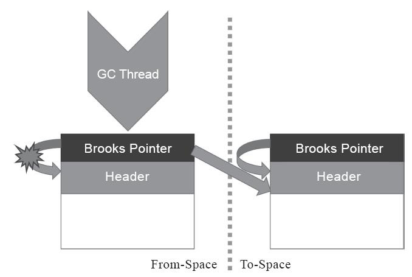

[TOC]

# 第 2 章 Java 内存区域与内存溢出异常

## 运行时数据区域


线程私有的区域：程序计数器、虚拟机栈、本地方法栈。

1. **程序计数器**

   程序计数器(Program Counter Register)是一块较小的内存空间，可以看作是当前线程所执行的字节码的行号指示器。

   两个作用：

   1. 帮助字节码解释器获取要执行的下一条字节码指令
   2. 发生线程切换时，保证线程可以恢复到正确的执行位置。

   如果线程正在执行的是一个Java方法，这个计数器记录的是正在执行的虚拟机字节码指令的地址；如果正在执行的是本地(Native)方法，这个计数器值则应为空(Undefined)。**此内存区域是唯一一个在《Java虚拟机规范》中没有规定任何OutOfMemoryError情况的区域。**

2. **Java 虚拟机栈**

   虚拟机栈描述的是Java方法执行的线程内存模型：每个方法被执行的时候，Java虚拟机都会同步创建一个<u>栈帧(Stack Frame)用于存储局部变量表、操作数栈、动态连接、方法出口等信息</u>。每一个方法被调用直至执行完毕的过程，就对应着一个栈帧在虚拟机栈中从入栈到出栈的过程。

   局部变量表存放了编译期可知的各种基本数据类型、对象引用和 returnAddress 类型。局部变量表所需的内存空间在编译期确定，在方法运行期间不会改变局部变量表的大小。

   规定了两类异常状态：

   1. 如果线程请求的栈深度大于虚拟机所允许的深度，将抛出StackOverflowError异常；
   2. 如果Java虚拟机栈容量可以动态扩展，当栈扩展时无法申请到足够的内存会抛出OutOfMemoryError异常。

3. **本地方法栈**

   本地方法栈(Native Method Stacks)与虚拟机栈所发挥的作用是非常相似的，其区别只是虚拟机栈为虚拟机执行Java方法（也就是字节码）服务，而本地方法栈则是为虚拟机使用到的本地(Native)方法服务。

   《Java虚拟机规范》对本地方法栈中方法使用的语言、使用方式与数据结构并没有任何强制规定，因此具体的虚拟机可以根据需要自由实现它，甚至有的Java虚拟机（譬如Hot-Spot虚拟机）直接就把本地方法栈和虚拟机栈合二为一。与虚拟机栈一样，本地方法栈也会在栈深度溢出或者栈扩展失败时分别抛出StackOverflowError和OutOfMemoryError异常。

4. **Java 堆**

   Java堆(Java Heap)是虚拟机所管理的内存中最大的一块。Java堆是被所有线程共享的一块内存区域，在虚拟机启动时创建。此内存区域的唯一目的就是存放对象实例，<u>Java世界里“几乎”所有的对象实例都在这里分配内存</u>。在《Java虚拟机规范》中对Java堆的描述是：“所有的对象实例以及数组都应当在堆上分配”，而随着Java语言的发展，现在已经能看到些许迹象表明日后可能出现值类型的支持，即使只考虑现在，由于即时编译技术的进步，尤其是逃逸分析技术的日渐强大，栈上分配、标量替换优化手段已经导致一些微妙的变化悄然发生，<u>所以说Java对象实例都分配在堆上也渐渐变得不是那么绝对了</u>。

   根据《Java虚拟机规范》的规定，Java堆可以处于物理上不连续的内存空间中，但在逻辑上它应该被视为连续的，这点就像我们用磁盘空间去存储文件一样，并不要求每个文件都连续存放。但对于大对象（典型的如数组对象），多数虚拟机实现出于实现简单、存储高效的考虑，很可能会要求连续的内存空间。

   Java堆既可以被实现成固定大小的，也可以是可扩展的，不过当前主流的Java虚拟机都是按照可扩展来实现的（通过参数-Xmx和-Xms设定）。<u>如果在Java堆中没有内存完成实例分配，并且堆也无法再扩展时，Java虚拟机将会抛出OutOfMemoryError异常。</u>

   > -Xmx\<size>：设置最大 Java 堆大小
   >
   > -Xms\<size>：设置初始 Java 堆大小

5. **方法区**

   方法区(Method Area)与Java堆一样，是各个线程共享的内存区域，它<u>用于存储已被虚拟机加载的类型信息、常量、静态变量、即时编译器编译后的代码缓存等数据</u>。虽然《Java虚拟机规范》中把方法区描述为堆的一个逻辑部分，但是它却有一个别名叫作“非堆”(Non-Heap)，目的是与Java堆区分开来。

   如何实现方法区属于虚拟机实现细节，不受《Java虚拟机规范》管束，并不要求统一。永久代和元空间都只是不同虚拟机对方法区的实现。

   根据《Java虚拟机规范》的规定，如果方法区无法满足新的内存分配需求时，将抛出OutOfMemoryError异常。

6. **运行时常量池**

   运行时常量池(Runtime Constant Pool)是方法区的一部分。Class文件中除了有类的版本、字段、方法、接口等描述信息外，还有一项信息是常量池表(Constant Pool Table)，用于存放编译期生成的各种字面量与符号引用，这部分内容将在类加载后存放到方法区的运行时常量池中。

   既然运行时常量池是方法区的一部分，自然受到方法区内存的限制，当常量池无法再申请到内存时会抛出OutOfMemoryError异常。

7. **直接内存**

   直接内存(Direct Memory)并不是虚拟机运行时数据区的一部分，也不是《Java虚拟机规范》中定义的内存区域。但是这部分内存也被频繁地使用，而且也可能导致OutOfMemoryError异常出现。

   在JDK 1.4中新加入了NIO(New Input/Output)类，引入了一种基于通道(Channel)与缓冲区(Buffer)的I/O方式，它可以使用Native函数库直接分配堆外内存，然后通过一个存储在Java堆里面的DirectByteBuffer对象作为这块内存的引用进行操作。这样能在一些场景中显著提高性能，因为避免了在Java堆和Native堆中来回复制数据。

   本机直接内存的分配不会受到Java堆大小的限制，但是，既然是内存，则肯定还是会受到本机总内存（包括物理内存、SWAP分区或者分页文件）大小以及处理器寻址空间的限制，一般服务器管理员配置虚拟机参数时，会根据实际内存去设置-Xmx等参数信息，但经常忽略掉直接内存，使得各个内存区域总和大于物理内存限制（包括物理的和操作系统级的限制），从而导致动态扩展时出现OutOfMemoryError异常。


## HotSpot 虚拟机对象

> 以下讨论的对象仅限于普通 Java 对象，不包括数组和 Class 对象

1. **对象的创建**

   在虚拟机中，对象的创建过程如下：

   1. **类加载检查**

      当Java虚拟机遇到一条字节码new指令时，首先将去检查这个指令的参数是否能在常量池中定位到一个类的符号引用，并且<u>检查这个符号引用代表的类是否已被加载、解析和初始化过。如果没有，那必须先执行相应的类加载过程。</u>

   2. **分配内存**

      在类加载检查通过后，接下来虚拟机将<u>为新生对象分配内存</u>。对象所需内存的大小在类加载完成后便可完全确定，为对象分配空间的任务实际上便等同于把一块确定大小的内存块从Java堆中划分出来。

      内存分配的方式有**“指针碰撞”(Bump The Pointer)**和**“空闲列表”(Free List)**两种，具体使用那种取决于 Java 堆是否规整，而 Java 堆是否规整<u>由 Java 虚拟机所采用的垃圾回收器是否带有空间压缩整理的能力决定</u>。

      > **指针碰撞**：Java堆中内存是绝对规整的，被使用过的内存都被放在一边，空闲的内存被放在另一边，中间放着一个指针作为分界点的指示器，那所分配内存就仅仅是把那个指针向空闲空间方向挪动一段与对象大小相等的距离。
      >
      > **空闲列表**：Java堆中的内存并不是规整的，已被使用的内存和空闲的内存相互交错在一起，那就没有办法简单地进行指针碰撞了，虚拟机就必须维护一个列表，记录上哪些内存块是可用的，在分配的时候从列表中找到一块足够大的空间划分给对象实例，并更新列表上的记录。

      除如何划分可用空间之外，还有另外一个需要考虑的问题：<u>对象创建在虚拟机中是非常频繁的行为，即使仅仅修改一个指针所指向的位置，在并发情况下也并不是线程安全的，可能出现正在给对象A分配内存，指针还没来得及修改，对象B又同时使用了原来的指针来分配内存的情况。</u>

      解决这个问题有两种可选方案：

      - 一种是对分配内存空间的动作进行同步处理——实际上虚拟机是采用CAS配上失败重试的方式保证更新操作的原子性；
      - 另外一种是把内存分配的动作按照线程划分在不同的空间之中进行，即每个线程在Java堆中预先分配一小块内存，称为本地线程分配缓冲(Thread Local Allocation Buffer，TLAB)，哪个线程要分配内存，就在哪个线程的本地缓冲区中分配，只有本地缓冲区用完了，分配新的缓存区时才需要同步锁定。虚拟机是否使用TLAB，可以通过-XX：+/-UseTLAB参数来设定。

   3. **初始化零值**

      内存分配完成之后，虚拟机必须将分配到的内存空间（但不包括对象头）都初始化为零值，如果使用了TLAB的话，这一项工作也可以提前至TLAB分配时顺便进行。这步操作保证了对象的实例字段在Java代码中可以不赋初始值就直接使用，使程序能访问到这些字段的数据类型所对应的零值。

   4. **设置对象头**

      完成初始化零值之后，虚拟机还要对对象进行必要的设置，例如这个对象是哪个类的实例、如何才能找到类的元数据信息、对象的哈希码（实际上对象的哈希码会延后到真正调用Object::hashCode()方法时才计算）、对象的GC分代年龄等信息。这些信息存放在对象的对象头(Object Header)之中。根据虚拟机当前运行状态的不同，如是否启用偏向锁等，对象头会有不同的设置方式。

   5. **执行 \<init>() 方法**

      在上面工作都完成之后，从虚拟机的视角来看，一个新的对象已经产生了。但是从Java程序的视角看来，对象创建才刚刚开始——构造函数，即 Class 文件中的\<init>()方法还没有执行，所有的字段都为默认的零值，对象需要的其他资源和状态信息也还没有按照预定的意图构造好。一般来说（由字节码流中new指令后面是否跟随invokespecial指令所决定，Java编译器会在遇到new关键字的地方同时生成这两条字节码指令，但如果直接通过其他方式产生的则不一定如此），new指令之后会接着执行\<init>()方法，按照程序员的意愿对对象进行初始化，这样一个真正可用的对象才算完全被构造出来。

2. **对象的内存布局**

   在HotSpot虚拟机里，对象在堆内存中的存储布局可以划分为三个部分：对象头(Header)、实例数据(Instance Data)和对齐填充(Padding)。

   **对象头**

   对象头包括两类信息，第一类是用于存储对象自身的运行时数据，如哈希码(HashCode)、GC分代年龄、锁状态标志、线程持有的锁、偏向线程ID、偏向时间戳等，这部分数据的长度在32位和64位的虚拟机（未开启压缩指针）中分别为32个比特和64个比特，官方称它为“Mark Word”。

   

   对象头的另外一部分是类型指针，即对象指向它的类型元数据的指针，Java虚拟机通过这个指针来确定该对象是哪个类的实例。

   **实例数据**

   实例数据部分是对象真正存储的有效信息，即我们在程序代码里面所定义的各种类型的字段内容，无论是从父类继承下来的，还是在子类中定义的字段都必须记录起来。

   **对齐填充**

   对齐填充，这并不是必然存在的，也没有特别的含义，它仅仅起着占位符的作用。由于<u>HotSpot虚拟机的自动内存管理系统要求对象起始地址必须是8字节的整数倍</u>，换句话说就是任何对象的大小都必须是8字节的整数倍。对象头部分已经被精心设计成正好是8字节的倍数（1倍或者2倍），因此，如果对象实例数据部分没有对齐的话，就需要通过对齐填充来补全。

3. **对象的访问定位**

   Java程序会通过栈上的reference数据来操作堆上的具体对象。由于reference类型在《Java虚拟机规范》里面只规定了它是一个指向对象的引用，并没有定义这个引用应该通过什么方式去定位、访问到堆中对象的具体位置，所以对象访问方式也是由虚拟机实现而定的，**主流的访问方式主要有使用<u>句柄</u>和<u>直接指针</u>两种**：

   - 如果使用句柄访问的话，Java堆中将可能会划分出一块内存来作为句柄池，reference中存储的就是对象的句柄地址，而句柄中包含了对象实例数据与类型数据各自具体的地址信息。

     

   - 如果使用直接指针访问的话，Java堆中对象的内存布局就必须考虑如何放置访问类型数据的相关信息，reference中存储的直接就是对象地址，如果只是访问对象本身的话，就不需要多一次间接访问的开销。

     

     使用句柄的好处是 reference 中存储的是稳定句柄地址，在对象移动时只会改变句柄中实例数据指针，而 reference 本身不需要被修改。使用直接指针来访问最大的好处就是速度更快，节省了一次指针定位的时间开销，由于对象访问在Java中非常频繁，因此这类开销积少成多也是一项极为可观的执行成本。

     > 就本书讨论的主要虚拟机 HotSpot 而言，它主要使用第二种方式进行对象访问。

## 实战：OutOfMemoryError 异常

在《Java虚拟机规范》的规定里，除了程序计数器外，虚拟机内存的其他几个运行时区域都有发生OutOfMemoryError（下文称OOM）异常的可能。

 **Java 堆溢出**  

要解决这个内存区域的异常，常规的处理方法是首先通过内存映像分析工具堆 Dump 出来的堆转储快找进行分析。第一步首先应确认内存中导致OOM的对象是否是必要的，也就是要先分清楚到底是出现了内存泄漏(Memory Leak)还是内存溢出(Memory Overflow)。

如果是内存泄漏，可进一步通过工具查看泄漏对象到GC Roots的引用链，找到泄漏对象是通过怎样的引用路径、与哪些GC Roots相关联，才导致垃圾收集器无法回收它们，根据泄漏对象的类型信息以及它到GC Roots引用链的信息。

如果不是内存泄漏，换句话说就是内存中的对象确实都是必须存活的，那就应当检查Java虚拟机的堆参数（-Xmx与-Xms）设置，与机器的内存对比，看看是否还有向上调整的空间。再从代码上检查是否存在某些对象生命周期过长、持有状态时间过长、存储结构设计不合理等情况，尽量减少程序运行期的内存消耗。

**虚拟机栈和本地方法栈溢出**

关于虚拟机栈和本地方法栈，在《Java虚拟机规范》中描述了两种异常：

1. 如果线程请求的栈深度大于虚拟机所允许的最大深度，将抛出StackOverflowError异常。
2. 如果虚拟机的栈内存允许动态扩展，当扩展栈容量无法申请到足够的内存时，将抛出OutOfMemoryError异常。

无论是由于栈帧太大还是虚拟机栈容量太小，当新的栈帧内存无法分配的时候，HotSpot虚拟机抛出的都是StackOverflowError异常。

> HotSpot 不允许栈动态扩展。

**方法区和运行时常量池溢出**

> 在 JDK 6 或更早之前的 HotSpot 虚拟机中，常量池都是分配在永久代中的，而在 JDK 7 或更高版本中字符串常量池移至 Java 堆中。

方法区的主要职责是用于存放类型的相关信息，如类名、访问修饰符、常量池、字段描述、方法描述等。因此可以通过在运行时产生大量的类去填满方法区，导致溢出。

> 实际场景：主流框架，例如 Srping、Hibernate 对类进行增强时，都会使用到 CGLib 这类字节码技术，当增强对类越多，就需要越大的方法区以保证动态生成的新类型可以载入内存。

在JDK 8以后，永久代便完全退出了历史舞台，元空间作为其替代者登场。在默认设置下，前面列举的那些正常的动态创建新类型的测试用例已经很难再迫使虚拟机产生方法区的溢出异常了。不过为了让使用者有预防实际应用里出现破坏性操作导致元空间溢出，HotSpot提供了一些参数作为元空间的防御措施，主要包括：

- -XX：MaxMetaspaceSize：设置元空间最大值，默认是-1，即不限制，或者说只受限于本地内存大小。
- -XX：MetaspaceSize：指定元空间的初始空间大小，以字节为单位，达到该值就会触发垃圾收集进行类型卸载，同时收集器会对该值进行调整：如果释放了大量的空间，就适当降低该值；如果释放了很少的空间，那么在不超过-XX：MaxMetaspaceSize（如果设置了的话）的情况下，适当提高该值。
- -XX：MinMetaspaceFreeRatio：作用是在垃圾收集之后控制最小的元空间剩余容量的百分比，可减少因为元空间不足导致的垃圾收集的频率。类似的还有-XX：Max-MetaspaceFreeRatio，用于控制最大的元空间剩余容量的百分比。

**本机直接内存溢出**

直接内存(Direct Memory)的容量大小可通过-XX：MaxDirectMemorySize参数来指定，如果不去指定，则默认与Java堆最大值（由-Xmx指定）一致。

由直接内存导致的内存溢出，一个明显的特征是在Heap Dump文件中不会看见有什么明显的异常情况，如果读者发现内存溢出之后产生的Dump文件很小，而程序中又直接或间接使用了DirectMemory（典型的间接使用就是NIO），那就可以考虑重点检查一下直接内存方面的原因了。

# 第 3 章 垃圾收集器与内存分配策略

## 概述

Java内存运行时区域的各个部分，其中程序计数器、虚拟机栈、本地方法栈3个区域随线程而生，随线程而灭，栈中的栈帧随着方法的进入和退出而有条不紊地执行着出栈和入栈操作。每一个栈帧中分配多少内存基本上是在类结构确定下来时就已知的，因此这几个区域的内存分配和回收都具备确定性，在这几个区域内就不需要过多考虑如何回收的问题，当方法结束或者线程结束时，内存自然就跟随着回收了。

<u>Java堆和方法区这两个区域则有着很显著的不确定性</u>：一个接口的多个实现类需要的内存可能会不一样，一个方法所执行的不同条件分支所需要的内存也可能不一样，只有处于运行期间，我们才能知道程序究竟会创建哪些对象，创建多少个对象，这部分内存的分配和回收是动态的。垃圾收集器所关注的正是这部分内存该如何管理。

## 对象已死？

### 引用计数法

在对象中添加一个引用计数器，每当有一个地方引用它时，计数器值就加一；当引用失效时，计数器值就减一；任何时刻计数器为零的对象就是不可能再被使用的。

引用计数法虽然占用了一些额外的内存空间来进行技术，但是原理简单，判定效率也很高。引用计数法的致命缺陷是无法解决循环引用的问题。

### 可达性分析算法

通过一系列称为“GC Roots”的根对象作为起始节点集，从这些节点开始，根据引用关系向下搜索，搜索过程所走过的路径称为“引用链”(Reference Chain)，如果某个对象到GC Roots间没有任何引用链相连，或者用图论的话来说就是从GC Roots到这个对象不可达时，则证明此对象是不可能再被使用的。

在 Java 技术体系中，固定可作为 GC Roots 的对象包括以下几种：

- 在虚拟机栈中引用的对象，譬如各个线程被调用的方法堆栈中使用到的参数、局部变量、临时变量等。
- 在方法区中类静态属性引用的对象，譬如 Java 类的引用类型变量。
- 在方法区中常量引用的对象，譬如字符串常量池（String Table）里的引用。
- 在本地方法栈中 JNI 引用的对象。
- Java 虚拟机内部的引用，如基本数据类型对应的 Class 对象，一些常驻的异常对象等，还有系统类加载器。
- 所有被同步锁（synchronized 关键字）持有的对象。
- 反映 Java 虚拟机内部情况的 JMXBean、JVMTI 中注册的回调、本地代码缓存等。

除了这些固定的 GC Roots 集合以外，根据用户所选用的垃圾收集器以及当前回收的内存区域不同，还可以有其他对象“临时性”地加入，共同构成完整GC Roots集合。譬如后文将会提到的分代收集和局部回收(Partial GC)，<u>如果只针对Java堆中某一块区域发起垃圾收集时（如最典型的只针对新生代的垃圾收集），必须考虑到内存区域是虚拟机自己的实现细节（在用户视角里任何内存区域都是不可见的），更不是孤立封闭的，所以某个区域里的对象完全有可能被位于堆中其他区域的对象所引用，这时候就需要将这些关联区域的对象也一并加入GC Roots集合中去，才能保证可达性分析的正确性</u>。

### 再谈引用

在JDK 1.2版之前，Java里面的引用是很传统的定义：<u>如果reference类型的数据中存储的数值代表的是另外一块内存的起始地址，就称该reference数据是代表某块内存、某个对象的引用</u>。这种定义并没有什么不对，只是现在看来有些过于狭隘了，一个对象在这种定义下只有“被引用”或者“未被引用”两种状态，<u>对于描述一些“食之无味，弃之可惜”的对象就显得无能为力</u>。譬如我们希望能描述一类对象：当内存空间还足够时，能保留在内存之中，如果内存空间在进行垃圾收集后仍然非常紧张，那就可以抛弃这些对象——很多系统的缓存功能都符合这样的应用场景。

在JDK 1.2版之后，Java对引用的概念进行了扩充，将引用分为**强引用(Strongly Re-ference)、软引用(Soft Reference)、弱引用(Weak Reference)和虚引用(Phantom Reference)**4种，这4种引用强度依次逐渐减弱。

- **强引用**是最传统的“引用”的定义，是指在程序代码之中普遍存在的引用赋值，即类似“Object obj=new Object()”这种引用关系。<u>无论任何情况下，只要强引用关系还存在，垃圾收集器就永远不会回收掉被引用的对象</u>。
- **软引用**是用来描述一些还有用，但非必须的对象。<u>只被软引用关联着的对象，在系统将要发生内存溢出异常前，会把这些对象列进回收范围之中进行第二次回收，如果这次回收还没有足够的内存，才会抛出内存溢出异常</u>。在JDK 1.2版之后提供了SoftReference类来实现软引用。
- **弱引用**也是用来描述那些非必须对象，但是它的强度比软引用更弱一些，<u>被弱引用关联的对象只能生存到下一次垃圾收集发生为止</u>。当垃圾收集器开始工作，无论当前内存是否足够，都会回收掉只被弱引用关联的对象。在JDK 1.2版之后提供了WeakReference类来实现弱引用。
- **虚引用**也称为“幽灵引用”或者“幻影引用”，它是最弱的一种引用关系。一个对象是否有虚引用的存在，完全不会对其生存时间构成影响，也无法通过虚引用来取得一个对象实例。<u>为一个对象设置虚引用关联的唯一目的只是为了能在这个对象被收集器回收时收到一个系统通知</u>。在JDK 1.2版之后提供了PhantomReference类来实现虚引用。

### 生存还是死亡？

即使在可达性分析算法中判定为不可达的对象，也不是“非死不可”的，这时候它们暂时还处于“缓刑”阶段，要真正宣告一个对象死亡，至少要经历两次标记过程：<u>如果对象在进行可达性分析后发现没有与GC Roots相连接的引用链，那它将会被第一次标记，随后进行一次筛选，筛选的条件是此对象是否有必要执行finalize()方法</u>。假如对象没有覆盖finalize()方法，或者finalize()方法已经被虚拟机调用过，那么虚拟机将这两种情况都视为“没有必要执行”。

> 任何一个对象的finalize()方法都只会被系统自动调用一次，如果对象面临下一次回收，它的finalize()方法不会被再次执行。
>
> 并且不建议使用 finalize() 方法。

### 回收方法区

方法区的垃圾收集主要回收两部分内容：**废弃的常量**和不再使用的类型。

回收废弃常量与回收Java堆中的对象非常类似。举个常量池中字面量回收的例子，假如一个字符串“java”曾经进入常量池中，但是当前系统又没有任何一个字符串对象的值是“java”，换句话说，已经没有任何字符串对象引用常量池中的“java”常量，且虚拟机中也没有其他地方引用这个字面量。如果在这时发生内存回收，而且垃圾收集器判断确有必要的话，这个“java”常量就将会被系统清理出常量池。常量池中其他类（接口）、方法、字段的符号引用也与此类似。

要判定一个类型是否属于“不再被使用的类”需要同时满足下面三个条件：

- 该类所有的实例都已经被回收，也就是Java堆中不存在该类及其任何派生子类的实例。
- 加载该类的类加载器已经被回收，这个条件除非是经过精心设计的可替换类加载器的场景，如OSGi、JSP的重加载等，否则通常是很难达成的。
- 该类对应的java.lang.Class对象没有在任何地方被引用，无法在任何地方通过反射访问该类的方法。

Java虚拟机被允许对满足上述三个条件的无用类进行回收，这里说的仅仅是“被允许”，而并不是和对象一样，没有引用了就必然会回收。关于是否要对类型进行回收，HotSpot虚拟机提供了-Xnoclassgc 参数进行控制，还可以使用-verbose：class以及-XX：+TraceClass-Loading、-XX：+TraceClassUnLoading 查看类加载和卸载信息，其中-verbose：class和-XX：+TraceClassLoading可以在Product版的虚拟机中使用，-XX：+TraceClassUnLoading参数需要FastDebug版的虚拟机支持。

## 垃圾回收算法

### 分代收集理论

分代收集理论的三个假说：

1. 弱分代假说(Weak Generational Hypothesis)：绝大多数对象都是朝生夕灭的。
2. 强分代假说(Strong Generational Hypothesis)：熬过越多次垃圾收集过程的对象就越难以消亡。
3. 跨代引用假说(Intergenerational Reference Hypothesis)：跨代引用相对于同代引用来说仅占极少数。

根据年龄划分不同的区域，对于存放存活时间短的对象的区域，每次回收时只关注如何保留少量存货而不是去标记哪些大量将要被回收的对象，就能以较低的代价回收到大量的空间；而对于存放存活时间长的对象的区域，虚拟机可以使用较低的频率来回收这个区域，这就同时兼顾了垃圾收集的时间开销和内存空间的有效利用。并且划分不同的区域后，垃圾收集器可以每次只回收其中某一个或者某些部分的区域，也能够针对不同区域安排与里面存储对象存亡特征相匹配的垃圾收集算法。

而根据假说 3 ，不需要为了少量的跨代引用去扫描整个老年代，也不必浪费空间专门记录每一个对象是否存在及存在哪些跨代引用，只需在新生代上建立一个全局的数据结构（该结构被称为“记忆集”，Remembered Set），这个结构把老年代划分成若干小块，标识出老年代的哪一块内存会存在跨代引用，发生 GC 时将这块内存的对象加入到 GC Roots 中。

部分收集（Partial GC）：指目标不是完整收集整个 Java 堆堆垃圾收集，其中又分为，

- 新生代收集（Minor GC / Young GC）：指目标只是新生代的垃圾收集。
- 老年代收集（Major GC / Old GC）：指目标只是老年代的垃圾收集。目前只有CMS收集器会有单独收集老年代的行为。另外请注意“Major GC”这个说法现在有点混淆，在不同资料上常有不同所指，需按上下文区分到底是指老年代的收集还是整堆收集。
- 混合收集（Mixed GC）：指目标是收集整个新生代以及部分老年代的垃圾收集。目前只有G1收集器会有这种行为。

整堆收集（Full GC）：收集整个Java堆和方法区的垃圾收集。

### 标记-清除算法

算法分为“标记”和“清除”两个阶段：<u>首先标记出所有需要回收的对象，在标记完成后，统一回收掉所有被标记的对象，也可以反过来，标记存活的对象，统一回收所有未被标记的对象</u>。

主要缺点有两个：

1. 执行效率不稳定，如果Java堆中包含大量对象，而且其中大部分是需要被回收的，这时必须进行大量标记和清除的动作，导致**标记和清除两个过程的执行效率都随对象数量增长而降低**；
2. 内存空间的碎片化问题，**标记、清除之后会产生大量不连续的内存碎片**，空间碎片太多可能会导致当以后在程序运行过程中需要分配较大对象时无法找到足够的连续内存而不得不提前触发另一次垃圾收集动作。

### 标记-复制算法

标记-复制算法常被简称为复制算法。为了解决标记-清除算法面对大量可回收对象时执行效率低的问题，1969 年Fenichel提出了一种称为“半区复制”(Semispace Copying)的垃圾收集算法，它<u>将可用内存按容量划分为大小相等的两块，每次只使用其中的一块。当这一块的内存用完了，就将还存活着的对象复制到另外一块上面，然后再把已使用过的内存空间一次清理掉。</u>

如果内存中多数对象都是存活的，这种算法将会产生大量的内存间复制的开销，但对于多数对象都是可回收的情况，算法需要复制的就是占少数的存活对象，而且每次都是针对整个半区进行内存回收，分配内存时也就不用考虑有空间碎片的复杂情况，只要移动堆顶指针，按顺序分配即可。这样实现简单，运行高效，不过其缺陷也显而易见，这种复制回收算法的代价是将可用内存缩小为了原来的一半，空间浪费未免太多了一点。

在1989年，Andrew Appel针对具备“朝生夕灭”特点的对象，提出了一种更优化的半区复制分代策略，现在称为“Appel式回收”。HotSpot虚拟机的Serial、ParNew等新生代收集器均采用了这种策略来设计新生代的内存布局。Appel式回收的具体做法是**把新生代分为一块较大的Eden空间和两块较小的Survivor空间，每次分配内存只使用Eden和其中一块Survivor。发生垃圾搜集时，将Eden和Survivor中仍然存活的对象一次性复制到另外一块Survivor空间上，然后直接清理掉Eden和已用过的那块Survivor空间。**

**HotSpot虚拟机默认Eden和Survivor的大小比例是8∶1**，也即每次新生代中可用内存空间为整个新生代容量的90%（Eden的80%加上一个Survivor的10%），只有一个Survivor空间，即10%的新生代是会被“浪费”的。当然，98%的对象可被回收仅仅是“普通场景”下测得的数据，任何人都没有办法百分百保证每次回收都只有不多于10%的对象存活，因此Appel式回收还有一个充当罕见情况的“逃生门”的安全设计，当Survivor空间不足以容纳一次Minor GC之后存活的对象时，就需要依赖其他内存区域（实际上大多就是老年代）进行分配担保(Handle Promotion)。

### 标记-整理算法

“标记-整理”(Mark-Compact)算法，其中的<u>标记过程仍然与“标记-清除”算法一样，但后续步骤不是直接对可回收对象进行清理，而是让所有存活的对象都向内存空间一端移动，然后直接清理掉边界以外的内存。</u>标记-清除算法与标记-整理算法的本质差异在于前者是一种非移动式的回收算法，而后者是移动式的。

标记-整理算法不会有内存碎片的问题，但是每次回收移动存活对象并更新所有引用这些对象的地方将会是一种极为负重的操作，而且这种对象移动操作必须全程暂停用户应用程序才能进行（Stop The World）。

## HotSpot 的算法细节实现

### 根节点枚举

迄今为止，所有收集器在根节点枚举这一步骤时都是必须暂停用户线程的，因此毫无疑问根节点枚举与之前提及的整理内存碎片一样会面临相似的“Stop The World”的困扰。现在可达性分析算法耗时最长的查找引用链的过程已经可以做到与用户线程一起并发，但**根节点枚举始终还是必须在一个能保障一致性的快照中才得以进行**——这里“一致性”的意思是整个枚举期间执行子系统看起来就像被冻结在某个时间点上，不会出现分析过程中，根节点集合的对象引用关系还在不断变化的情况，若这点不能满足的话，分析结果准确性也就无法保证。这是导致垃圾收集过程必须停顿所有用户线程的其中一个重要原因，即使是号称停顿时间可控，或者（几乎）不会发生停顿的CMS、G1、ZGC等收集器，枚举根节点时也是必须要停顿的。

由于目前主流Java虚拟机使用的都是准确式垃圾收集（能够确定内存中某个位置的数据具体类型），所以当用户线程停顿下来之后，其实并不需要一个不漏地检查完所有执行上下文和全局的引用位置，虚拟机应当是有办法直接得到哪些地方存放着对象引用的。**在HotSpot的解决方案里，是使用一组称为OopMap的数据结构来达到这个目的**。<u>一旦类加载动作完成的时候，HotSpot就会把对象内什么偏移量上是什么类型的数据计算出来，在即时编译过程中，也会在特定的位置记录下栈里和寄存器里哪些位置是引用。这样收集器在扫描时就可以直接得知这些信息了，并不需要真正一个不漏地从方法区等GC Roots开始查找。</u>

### 安全点

在OopMap的协助下，HotSpot可以快速准确地完成GC Roots枚举，但 HotSpot 并不会为每一条指令都生成对应的OopMap，那将会需要大量的额外存储空间，这样垃圾收集伴随而来的空间成本就会变得无法忍受的高昂。

实际上HotSpot也的确没有为每条指令都生成OopMap，前面已经提到，只是在“特定的位置”记录了这些信息，这些位置被称为安全点(Safepoint)。**有了安全点的设定，也就决定了用户程序执行时并非在代码指令流的任意位置都能够停顿下来开始垃圾收集，而是强制要求必须执行到达安全点后才能够暂停。**因此，安全点的选定既不能太少以至于让收集器等待时间过长，也不能太过频繁以至于过分增大运行时的内存负荷。**安全点位置的选取基本上是以“是否具有让程序长时间执行的特征”为标准进行选定的**，因为每条指令执行的时间都非常短暂，程序不太可能因为指令流长度太长这样的原因而长时间执行，**“长时间执行”的最明显特征就是指令序列的复用，例如方法调用、循环跳转、异常跳转等都属于指令序列复用，所以只有具有这些功能的指令才会产生安全点**。

对于安全点，另外一个需要考虑的问题是，如何在垃圾收集发生时让所有线程（这里其实不包括执行JNI调用的线程）都跑到最近的安全点，然后停顿下来。**这里有两种方案可供选择：抢先式中断(Preemptive Suspension)和主动式中断(Voluntary Suspension)**，<u>抢先式中断不需要线程的执行代码主动去配合，在垃圾收集发生时，系统首先把所有用户线程全部中断，如果发现有用户线程中断的地方不在安全点上，就恢复这条线程执行，让它一会再重新中断，直到跑到安全点上。</u>现在几乎没有虚拟机实现采用抢先式中断来暂停线程响应GC事件。

而<u>主动式中断的思想是当垃圾收集需要中断线程的时候，不直接对线程操作，仅仅简单地设置一个标志位，各个线程执行过程时会不停地主动去轮询这个标志，一旦发现中断标志为真时就自己在最近的安全点上主动中断挂起</u>。**轮询标志的地方和安全点是重合的，另外还要加上所有创建对象和其他需要在Java堆上分配内存的地方，这是为了检查是否即将要发生垃圾收集，避免没有足够内存分配新对象。**

由于轮询操作在代码中会频繁出现，这要求它必须足够高效。**HotSpot使用内存保护陷阱的方式，把轮询操作精简至只有一条汇编指令的程度。**下面代码清单中的test指令就是HotSpot生成的轮询指令，当需要暂停用户线程时，虚拟机把0x160100的内存页设置为不可读，那线程执行到test指令时就会产生一个自陷异常信号，然后在预先注册的异常处理器中挂起线程实现等待，这样仅通过一条汇编指令便完成安全点轮询和触发线程中断了。

```
0x01b6d627: call   0x01b2b210          ; OopMap{[60]=Oop off=460}
                                       ; *invokeinterface size
                                       ; - Client1::main@113 (line 23)
                                       ;   {virtual_call}
    0x01b6d62c: nop                    ; OopMap{[60]=Oop off=461}
                                       ; *if_icmplt
                                       ; - Client1::main@118 (line 23)
    0x01b6d62d: test   %eax,0x160100   ;   {poll}
    0x01b6d633: mov    0x50(%esp),%esi
    0x01b6d637: cmp    %eax,%es
```

### 安全区域

使用安全点的设计似乎已经完美解决如何停顿用户线程，让虚拟机进入垃圾回收状态的问题了，但实际情况却并不一定。**安全点机制保证了程序执行时，在不太长的时间内就会遇到可进入垃圾收集过程的安全点。**但是，<u>程序“不执行”的时候呢？</u>所谓的程序不执行就是没有分配处理器时间，典型的场景便是用户线程处于Sleep状态或者Blocked状态，这时候线程无法响应虚拟机的中断请求，不能再走到安全的地方去中断挂起自己，虚拟机也显然不可能持续等待线程重新被激活分配处理器时间。<u>对于这种情况，就必须引入安全区域(Safe Region)来解决。</u>

**安全区域是指能够确保在某一段代码片段之中，引用关系不会发生变化，因此，在这个区域中任意地方开始垃圾收集都是安全的。我们也可以把安全区域看作被扩展拉伸了的安全点。**

当用户线程执行到安全区域里面的代码时，首先会标识自己已经进入了安全区域，那样当这段时间里虚拟机要发起垃圾收集时就不必去管这些已声明自己在安全区域内的线程了。**当线程要离开安全区域时，它要检查虚拟机是否已经完成了根节点枚举（或者垃圾收集过程中其他需要暂停用户线程的阶段），如果完成了，那线程就当作没事发生过，继续执行；否则它就必须一直等待，直到收到可以离开安全区域的信号为止。**

### 记忆集和卡表

**记忆集是一种用于记录从非收集区域指向收集区域的指针集合的抽象数据结构。**

<u>记录全部含跨代引用对象的实现方案，无论是空间占用还是维护成本都相当高昂。</u>而在垃圾收集的场景中，收集器**只需要通过记忆集判断出某一块非收集区域是否存在有指向了收集区域的指针就可以了**，并不需要了解这些跨代指针的全部细节。那设计者在实现记忆集的时候，便可以选择更为粗犷的记录粒度来节省记忆集的存储和维护成本，下面列举了一些可供选择（当然也可以选择这个范围以外的）的记录精度：

- **字长精度**：每个记录精确到一个机器字长（就是处理器的寻址位数，如常见的32位或64位，这个精度决定了机器访问物理内存地址的指针长度），该字包含跨代指针。
- **对象精度**：每个记录精确到一个对象，该对象里有字段含有跨代指针。
- **卡精度**：每个记录精确到一块内存区域，该区域内有对象含有跨代指针。

其中，第三种<u>“卡精度”所指的是用一种称为“卡表”(Card Table)的方式去实现记忆集</u>，这也是目前最常用的一种记忆集实现形式。它**定义了记忆集的记录精度、与堆内存的映射关系**等。关于卡表与记忆集的关系，读者不妨按照Java语言中HashMap与Map的关系来类比理解。
卡表最简单的形式可以只是一个字节数组，而HotSpot虚拟机确实也是这样做的。以下这行代码是HotSpot默认的卡表标记逻辑：

```
CARD_TABLE [this address >> 9] = 0;
```

字节数组 CARD_TABLE 的每一个元素都对应着其标识的内存区域中一块特定大小的内存块，这个内存块被称作“卡页”(Card Page)。一般来说，卡页大小都是以2的N次幂的字节数，通过上面代码可以看出HotSpot中使用的卡页是2的9次幂，即512字节（地址右移9位，相当于用地址除以512）。


一个卡页的内存中通常包含不止一个对象，只要卡页内有一个（或更多）对象的字段存在着跨代指针，那就将对应卡表的数组元素的值标识为1，称为这个元素变脏(Dirty)，没有则标识为0。在垃圾收集发生时，只要筛选出卡表中变脏的元素，就能轻易得出哪些卡页内存块中包含跨代指针，把它们加入GC Roots中一并扫描。

### 写屏障

我们已经解决了如何使用记忆集来缩减GC Roots扫描范围的问题，但还没有解决**卡表元素如何维护的问题**，例如它们何时变脏、谁来把它们变脏等。

- 何时变脏：有其他分代区域中对象引用了本区域对象时，其对应的卡表元素就应该变脏，变脏时间点原则上应该发生在引用类型字段赋值的那一刻。

- 如何变脏：为了兼顾解释执行和编译执行的场景，就必须找到一个在机器码层面的手段，把维护卡表的动作放到每一个赋值操作之中

**在HotSpot虚拟机里是通过写屏障(Write Barrier)技术维护卡表状态的。**

> 这里提到的“写屏障”，以及后面在低延迟收集器中会提到的“读屏障”与解决并发乱序执行问题中的“内存屏障”区分开来，避免混淆。

<u>**写屏障可以看作在虚拟机层面对“引用类型字段赋值”这个动作的AOP切面**，在引用对象赋值时会产生一个环形(Around)通知，供程序执行额外的动作，也就是说赋值的前后都在写屏障的覆盖范畴内。在**赋值前的部分的写屏障叫作写前屏障(Pre-Write Barrier)**，在**赋值后的则叫作写后屏障(Post-Write Barrier)**。</u>HotSpot虚拟机的许多收集器中都有使用到写屏障，但直至G1收集器出现之前，其他收集器都只用到了写后屏障。下面这段代码是一段更新卡表状态的简化逻辑：

```c++
void oop_field_store(oop* field, oop new_value) {
    // 引用字段赋值操作
    *field = new_value;
    // 写后屏障，在这里完成卡表状态更新
    post_write_barrier(field, new_value);
}
```

写屏障的问题：

1. **产生额外的开销**

   应用写屏障后，虚拟机就会为所有赋值操作生成相应的指令，一旦收集器在写屏障中增加了更新卡表操作，无论更新的是不是老年代对新生代对象的引用，每次只要对引用进行更新，就会产生额外的开销，不过这个开销与Minor GC时扫描整个老年代的代价相比还是低得多的。

2. **“伪共享”(False Sharing)问题**

   > 伪共享是处理并发底层细节时一种经常需要考虑的问题，现代中央处理器的缓存系统中是以缓存行(Cache Line)为单位存储的，当多线程修改互相独立的变量时，如果这些变量恰好共享同一个缓存行，就会彼此影响（写回、无效化或者同步）而导致性能降低，这就是伪共享问题。

   假设处理器的缓存行大小为64字节，由于一个卡表元素占1个字节，64个卡表元素将共享同一个缓存行。这64个卡表元素对应的卡页总的内存为32KB（64×512字节），也就是说如果不同线程更新的对象正好处于这32KB的内存区域内，就会**导致更新卡表时正好写入同一个缓存行而影响性能**（因为同时只能有一个线程操作同一个缓存行）。
   
   为了避免伪共享问题，一种简单的解决方案是不采用无条件的写屏障，而是先检查卡表标记，只有当该卡表元素未被标记过时才将其标记为变脏。在JDK 7之后，HotSpot虚拟机增加了一个新的参数-XX：+UseCondCardMark，用来决定是否开启卡表更新的条件判断。开启会增加一次额外判断的开销，但能够避免伪共享问题，两者各有性能损耗，是否打开要根据应用实际运行情况来进行测试权衡。

### 并发的可达性分析

当前主流编程语言的垃圾收集器基本上都是依靠可达性分析算法来判定对象是否存活的，可达性分析算法理论上要求全过程都基于一个能保障一致性的快照中才能够进行分析，这意味着必须全程冻结用户线程的运行。

在根节点枚举这个步骤中，由于GC Roots相比起整个Java堆中全部的对象毕竟还算是极少数，且在各种优化技巧（如OopMap）的加持下，它带来的停顿已经是非常短暂且相对固定（不随堆容量而增长）的了。可从GC Roots再继续往下遍历对象图，这一步骤的停顿时间就必定会与Java堆容量直接成正比例关系了：堆越大，存储的对象越多，对象图结构越复杂，要标记更多对象而产生的停顿时间自然就更长，因此如果能够削减这部分停顿时间的话，那收益也将会是系统性的。

想解决或者降低用户线程的停顿，就要先搞清楚**为什么必须在一个能保障一致性的快照上才能进行对象图的遍历？**

首先先引入三色标记(Tri-color Marking)工具来辅助推导，把遍历对象图过程中遇到的对象，按照“是否访问过”这个条件标记成以下三种颜色：

- **白色：表示对象尚未被垃圾收集器访问过**。显然在可达性分析刚刚开始的阶段，所有的对象都是白色的，若在分析结束的阶段，仍然是白色的对象，即代表不可达。
- **黑色：表示对象已经被垃圾收集器访问过，且这个对象的所有引用都已经扫描过**。黑色的对象代表已经扫描过，它是安全存活的，如果有其他对象引用指向了黑色对象，无须重新扫描一遍。黑色对象不可能直接（不经过灰色对象）指向某个白色对象。
- **灰色：表示对象已经被垃圾收集器访问过，但这个对象上至少存在一个引用还没有被扫描过**。

可达性分析的扫描过程，可以看作对象图上一股以灰色为波峰的波纹从黑向白推进的过程，如果用户线程此时是冻结的，只有收集器线程在工作，那不会有任何问题。

但如果用户线程与收集器是并发工作呢？收集器在对象图上标记颜色，同时用户线程在修改引用关系——即修改对象图的结构，这样可能出现两种后果。

1. **把原本消亡的对象错误标记为存活**，这不是好事，但其实是可以容忍的，只不过产生了一点逃过本次收集的**浮动垃圾**而已，下次收集清理掉就好。

2. **把原本存活的对象错误标记为已消亡**，这就是非常致命的后果了，程序肯定会因此发生错误，下面演示了这样的致命错误具体是如何产生的。

   

**当且仅当以下两个条件同时满足时，会产生“对象消失”的问题**，即原本应该是黑色的对象被误标为白色：

- **赋值器插入了一条或多条从黑色对象到白色对象的新引用**；
- **赋值器删除了全部从灰色对象到该白色对象的直接或间接引用**。

因此，要解决并发扫描时的对象消失问题，只需破坏这两个条件的任意一个即可。由此分别产生了两种解决方案：**增量更新(Incremental Update)**和**原始快照(Snapshot At The Beginning，SATB)**。

**增量更新**破坏的是第一个条件，当黑色对象插入新的指向白色对象的引用关系时，就将这个新插入的引用记录下来，等并发扫描结束之后，再将这些记录过的引用关系中的黑色对象为根，重新扫描一次。这可以简化理解为，黑色对象一旦新插入了指向白色对象的引用之后，它就变回灰色对象了。

**原始快照**要破坏的是第二个条件，当灰色对象要删除指向白色对象的引用关系时，就将这个要删除的引用记录下来，在并发扫描结束之后，再将这些记录过的引用关系中的灰色对象为根，重新扫描一次。这也可以简化理解为，无论引用关系删除与否，都会按照刚刚开始扫描那一刻的对象图快照来进行搜索。

以上无论是对引用关系记录的插入还是删除，虚拟机的记录操作都是通过写屏障实现的。在HotSpot虚拟机中，增量更新和原始快照这两种解决方案都有实际应用，譬如，**CMS是基于增量更新来做并发标记的，G1、Shenandoah则是用原始快照来实现**。
## 经典垃圾收集器


### Serial / Serial Old 收集器

Serial / Serial Old 收集器收集器是**单线程工作的收集器**，但它的“单线程”的意义并不仅仅是说明它只会使用一个处理器或一条收集线程去完成垃圾收集工作，更重要的是强调在它进行垃圾收集时，必须暂停其他所有工作线程，直到它收集结束。“

Serial 是新生代收集器，使用复制算法；Serial Old 收集器是老年代收集器，使用标记-整理算法。

Serial / Serial Old 收集器运行示意图。


Serial Old 收集器的主要意义也是供客户端模式下的 HotSpot 虚拟机使用。如果在服务端模式下，它也可能有两种用途：一种是在JDK 5以及之前的版本中与 Parallel Scavenge 收集器搭配使用，另外一种就是作为 CMS 收集器发生失败时的后备预案，在并发收集发生Concurrent Mode Failure时使用。

### ParNew 收集器

**ParNew 收集器实质上是 Serial 收集器的多线程并行版本**，除了同时使用多条线程进行垃圾收集之外，其余的行为包括Serial收集器可用的所有控制参数（例如：-XX：SurvivorRatio、-XX：PretenureSizeThreshold、-XX：HandlePromotionFailure等）、收集算法、Stop The World、对象分配规则、回收策略等都与Serial收集器完全一致，在实现上这两种收集器也共用了相当多的代码。

ParNew / Serial Old 收集器运行示意图。


除了 Serial 收集器外，目前只有 ParNew 能与 CMS 收集器配合使用。

### Parallel Scavenge / Parallel Old 收集器

**Parallel Scavenge 收集器也是一款新生代收集器，它同样是基于标记-复制算法实现的收集器，也是能够并行收集的多线程收集器。**

**Parallel Scavenge 收集器的关注点是吞吐量(Throughput)**，目标是达到一个可控制的吞吐量。所谓吞吐量就是处理器用于运行用户代码的时间与处理器总消耗时间的比值，即：
$$
吞吐量 = \frac{运行用户代码时间}{运行用户代码时间 + 运行垃圾收集时间}
$$
如果虚拟机完成某个任务，用户代码加上垃圾收集总共耗费了100分钟，其中垃圾收集花掉1分钟，那吞吐量就是99%。**停顿时间越短就越适合需要与用户交互或需要保证服务响应质量的程序，良好的响应速度能提升用户体验**；而**高吞吐量则可以最高效率地利用处理器资源，尽快完成程序的运算任务，主要适合在后台运算而不需要太多交互的分析任务**。

Parallel Scavenge 收集器提供了两个参数用于精确控制吞吐量，分别是：

- 控制最大垃圾收集停顿时间的 -XX：MaxGCPauseMillis参数

  -XX：MaxGCPauseMillis 参数允许的值是一个大于 0 的毫秒数，收集器将尽力保证内存回收花费的时间不超过用户设定值。

  垃圾收集停顿时间缩短是以牺牲吞吐量和新生代空间为代价换取的：系统把新生代调得小一些，收集 300MB 新生代肯定比收集 500MB 快，但这也直接导致垃圾收集发生得更频繁，原来10秒收集一次、每次停顿100毫秒，现在变成5秒收集一次、每次停顿70毫秒。停顿时间的确在下降，但吞吐量也降下来了。

- 直接设置吞吐量大小的 -XX：GCTimeRatio参数

  -XX：GCTimeRatio 参数的值则应当是一个大于 0 小于 100 的整数，也就是垃圾收集时间占总时间的比率，相当于吞吐量的倒数。譬如把此参数设置为 19，那允许的最大垃圾收集时间就占总时间的 5%（即1/(1+19)），默认值为 99，即允许最大1%（即1/(1+99)）的垃圾收集时间。

**由于与吞吐量关系密切，Parallel Scavenge收集器也经常被称作“吞吐量优先收集器”。**

除上述两个参数之外，**Parallel Scavenge 收集器还有一个参数 -XX：+UseAdaptiveSizePolicy 值得关注**。这是一个<u>开关参数</u>，当这个参数被激活之后，就不需要人工指定新生代的大小(-Xmn)、Eden与Survivor区的比例(-XX：SurvivorRatio)、晋升老年代对象大小(-XX：PretenureSizeThreshold)等细节参数了，虚拟机会根据当前系统的运行情况收集性能监控信息，动态调整这些参数以提供最合适的停顿时间或者最大的吞吐量。这种调节方式称为垃圾收集的自适应的调节策略(GC Ergonomics)。<u>自适应调节策略也是Parallel Scavenge收集器区别于ParNew收集器的一个重要特性。</u>

**Parallel Old 是 Parallel Scavenge 收集器的老年代版本，支持多线程并发收集，基于标记-整理算法实现。**

Parallel Scavenge/Parallel Old收集器运行示意图。


### CMS 收集器

**CMS (Concurrent Mark Sweep) 收集器是一种以获取<u>最短回收停顿时间为目标</u>的老年代收集器。**

CMS 收集器是基于标记-清除算法实现的，整个过程分为四个步骤：

1. **初始标记 (CMS initial mark)**：仅仅只是标记一下GC Roots能直接关联到的对象，速度很快。
2. **并发标记 (CMS concurrent mark)**：从GC Roots的直接关联对象开始遍历整个对象图的过程，这个过程耗时较长但是不需要停顿用户线程，可以与垃圾收集线程一起并发运行。
3. **重新标记 (CMS remark)**：为了修正并发标记期间，因用户程序继续运作而导致标记产生变动的那一部分对象的标记记录，这个阶段的停顿时间通常会比初始标记阶段稍长一些，但也远比并发标记阶段的时间短
4. **并发清除 (CMS concurrent sweep)**：清理删除掉标记阶段判断的已经死亡的对象，由于不需要移动存活对象，所以这个阶段也是可以与用户线程同时并发的。

**其中初始标记、重新标记这两个步骤仍然需要“Stop The World”。**由于在整个过程中耗时最长的并发标记和并发清除阶段中，垃圾收集器线程都可以与用户线程一起工作，所以从总体上来说，CMS收集器的内存回收过程是与用户线程一起并发执行的。

Concurrent Mark Sweep收集器运行示意图。


CMS 收集器的三个明显的缺点：

1. **对处理器资源敏感，在并发阶段，虽然不会导致用户线程停顿，但却会因为占用了一部分线程（或者说处理器的计算能力）而导致应用程序变慢，降低总吞吐量。**

   CMS默认启动的回收线程数是（处理器核心数量+3）/4，也就是说，如果处理器核心数在四个或以上，并发回收时垃圾收集线程只占用不超过25%的处理器运算资源，并且会随着处理器核心数量的增加而下降。但是当处理器核心数量不足四个时，CMS对用户程序的影响就可能变得很大。如果应用本来的处理器负载就很高，还要分出一半的运算能力去执行收集器线程，就可能导致用户程序的执行速度忽然大幅降低。

   为了缓解这种情况，虚拟机提供了一种称为“增量式并发收集器”(Incremental Concurrent Mark Sweep/i-CMS)的CMS收集器变种，所做的事情和以前单核处理器年代PC机操作系统靠抢占式多任务来模拟多核并行多任务的思想一样，是在并发标记、清理的时候让收集器线程、用户线程交替运行，尽量减少垃圾收集线程的独占资源的时间，这样整个垃圾收集的过程会更长，但对用户程序的影响就会显得较少一些，直观感受是速度变慢的时间更多了，但速度下降幅度就没有那么明显。**实践证明增量式的CMS收集器效果很一般**，从JDK 7开始，i-CMS模式已经被声明为“deprecated”，即已过时不再提倡用户使用，到JDK 9发布后i-CMS模式被完全废弃。

2. **无法处理“浮动垃圾”（Floating Garbage），有可能出现“Con-current Mode Failure”失败进而导致另一次完全“Stop The World”的Full GC的产生。**

   在 CMS 的并发标记和并发清理阶段，用户线程是还在继续运行的，程序在运行自然就还会伴随有新的垃圾对象不断产生，但这一部分垃圾对象是出现在标记过程结束以后，CMS 无法在当次收集中处理掉它们，只好留待下一次垃圾收集时再清理掉。这一部分垃圾就称为“浮动垃圾”。

   同样也是由于在垃圾收集阶段用户线程还需要持续运行，那就还需要预留足够内存空间提供给用户线程使用，因此 CMS 收集器不能像其他收集器那样等待到老年代几乎完全被填满了再进行收集，必须预留一部分空间供并发收集时的程序运作使用。在JDK 5的默认设置下，CMS收集器当老年代使用了68%的空间后就会被激活，这是一个偏保守的设置，如果在实际应用中老年代增长并不是太快，<u>可以适当调高参数-XX：CMSInitiatingOccu-pancyFraction 的值来提高CMS的触发百分比，降低内存回收频率</u>，获取更好的性能。到了JDK 6时，CMS收集器的启动阈值就已经默认提升至92%。但这又会更容易面临另一种风险：要是CMS运行期间预留的内存无法满足程序分配新对象的需要，就会出现一次“并发失败”(Concurrent Mode Failure)，这时候虚拟机将不得不启动后备预案：冻结用户线程的执行，临时启用Serial Old收集器来重新进行老年代的垃圾收集，但这样停顿时间就很长了。

   所以参数-XX：CMSInitiatingOccupancyFraction设置得太高将会很容易导致大量的并发失败产生，性能反而降低，用户应在生产环境中根据实际应用情况来权衡设置。

3. **CMS是基于“标记-清除”算法实现的，这意味着收集结束时会有大量空间碎片产生。**

   空间碎片过多时，将会给大对象分配带来很大麻烦，往往会出现老年代还有很多剩余空间，但就是无法找到足够大的连续空间来分配当前对象，而不得不提前触发一次 Full GC 的情况。

   为了解决这个问题，CMS收集器提供了一个-XX：+UseCMS-CompactAtFullCollection开关参数（默认是开启的，此参数从JDK 9开始废弃），用于在CMS收集器不得不进行Full GC时开启内存碎片的合并整理过程，由于这个内存整理必须移动存活对象，（在Shenandoah和ZGC出现前）是无法并发的。这样空间碎片问题是解决了，但停顿时间又会变长，因此虚拟机设计者们还提供了另外一个参数-XX：CMSFullGCsBefore-Compaction（此参数从JDK 9开始废弃），这个参数的作用是要求CMS收集器在执行过若干次（数量由参数值决定）不整理空间的Full GC之后，下一次进入Full GC前会先进行碎片整理（默认值为0，表示每次进入Full GC时都进行碎片整理）。

### Garbage First 收集器

Garbage First（简称G1）收集器是垃圾收集器技术发展历史上的里程碑式的成果，它**开创了收集器面向局部收集的设计思路和基于Region的内存布局形式**。

作为CMS收集器的替代者和继承人，设计者们希望**做出一款能够建立起“停顿时间模型”(Pause Prediction Model)的收集器**，停顿时间模型的意思是能够支持指定在一个长度为M毫秒的时间片段内，消耗在垃圾收集上的时间大概率不超过N毫秒这样的目标，这几乎已经是实时Java(RTSJ)的中软实时垃圾收集器特征了。

之前的所有其他收集器，垃圾收集的目标范围要么是整个新生代(Minor GC)，要么是整个老年代(Major GC)，再要么就是整个Java堆(Full GC)。G1 跳出了这个樊笼，它可以**面向堆内存任何部分来组成回收集（Collection Set，一般简称CSet）进行回收，衡量标准不再是它属于哪个分代，而是哪块内存中存放的垃圾数量最多，回收收益最大，这就是G1收集器的Mixed GC模式**。

G1 也仍遵循分代收集理论设计，但是**不再坚持固定大小以及固定数量的分代区域划分，而是把连续的Java堆划分为多个大小相等的独立区域(Region)，每一个Region都可以根据需要，扮演新生代的Eden空间、Survivor空间，或者老年代空间**。**收集器能够对扮演不同角色的Region采用不同的策略去处理**，这样无论是新创建的对象还是已经存活了一段时间、熬过多次收集的旧对象都能获取很好的收集效果。

**Region 中还有一类特殊的 Humongous 区域，专门用来存储大对象**。G1认为只要大小**超过了一个Region容量一半的对象即可判定为大对象**。每个Region的大小可以通过参数-XX：G1HeapRegionSize设定，取值范围为1MB～32MB，且应为2的N次幂。而对于那些超过了整个Region容量的超级大对象，将会被存放在N个连续的Humongous Region之中，<u>G1的大多数行为都把Humongous Region作为老年代的一部分来进行看待</u>。

**G1 收集器会跟踪每个 Region 里面的垃圾堆积的“价值”大小**，价值即回收所获得的空间大小以及回收所需时间的经验值，然后**在后台维护一个优先级列表**，每次根据用户设定允许的收集停顿时间（使用参数-XX：MaxGCPauseMillis指定，默认值是200毫秒），**优先处理回收价值收益最大的那些 Region**，这也就是“Garbage First”名字的由来。

G1 收集器至少有以下这些关键的细节问题需要妥善解决：

- **将Java堆分成多个独立Region后，Region里面存在的跨Region引用对象如何解决？**

  在 G1 收集器上，**每个 Region 都维护有自己的记忆集，这些记忆集会记录下别的 Region 指向自己的指针，并标记这些指针分别在哪些卡页的范围之内。**G1 的记忆集在存储结构的本质上是一种哈希表，Key 是别的 Region 的起始地址，Value 是一个集合，里面存储的元素是卡表的索引号。这种“双向”的卡表结构（卡表是“我指向谁”，这种结构还记录了“谁指向我”）比原来的卡表实现起来更复杂，同时由于Region数量比传统收集器的分代数量明显要多得多，因此 **G1 收集器要比其他的传统垃圾收集器有着更高的内存占用负担**。根据经验，G1至少要耗费大约相当于Java堆容量10%至20%的额外内存来维持收集器工作。

- **在并发标记阶段如何保证收集线程与用户线程互不干扰地运行？**

  G1收集器通过**原始快照(SATB)**算法来解决用户线程改变对象引用关系时，不会打破原本的对象图结构，导致标记结果出现错误的问题。此外，<u>垃圾收集对用户线程的影响还体现在回收过程中新创建对象的内存分配上，程序要继续运行就肯定会持续有新对象被创建，G1为每一个Region设计了两个名为TAMS(Top at Mark Start)的指针，把Region中的一部分空间划分出来用于并发回收过程中的新对象分配，并发回收时新分配的对象地址都必须要在这两个指针位置以上。G1收集器默认在这个地址以上的对象是被隐式标记过的，即默认它们是存活的，不纳入回收范围。</u>与CMS中的“Concurrent Mode Failure”失败会导致Full GC类似，如果内存回收的速度赶不上内存分配的速度，G1收集器也要被迫冻结用户线程执行，导致Full GC而产生长时间“Stop The World”。

- **怎样建立起可靠的停顿预测模型？**

  用户通过-XX：MaxGCPauseMillis参数指定的停顿时间只意味着垃圾收集发生之前的期望值，但G1收集器要怎么做才能满足用户的期望呢？G1收集器的停顿预测模型是**以衰减均值(Decaying Average)为理论基础**来实现的，**在垃圾收集过程中，G1收集器会记录每个Region的回收耗时、每个Region记忆集里的脏卡数量等各个可测量的步骤花费的成本，并分析得出平均值、标准偏差、置信度等统计信息。**这里强调的“衰减平均值”是指它会比普通的平均值更容易受到新数据的影响，平均值代表整体平均状态，但衰减平均值更准确地代表“最近的”平均状态。换句话说，Region的统计状态越新越能决定其回收的价值。然后通过这些信息预测现在开始回收的话，由哪些Region组成回收集才可以在不超过期望停顿时间的约束下获得最高的收益。

G1 收集器的运作过程大致可划分为以下四个步骤：

1. **初始标记(Initial Marking)**：标记 GC Roots 能直接关联到的对象，并且修改 TAMS 指针的值，让下一阶段用户线程并发运行时，能正确地在可用的Region中分配新对象。这个阶段需要停顿线程，但耗时很短，而且是借用进行Minor GC的时候同步完成的，所以G1收集器在这个阶段实际并没有额外的停顿。
2. **并发标记(Concurrent Marking)**：从GC Root开始对堆中对象进行可达性分析，递归扫描整个堆里的对象图，找出要回收的对象，这阶段耗时较长，但可与用户程序并发执行。当对象图扫描完成以后，还要重新处理SATB记录下的在并发时有引用变动的对象。
3. **最终标记(Final Marking)**：对用户线程做另一个短暂的暂停，用于处理并发阶段结束后仍遗留下来的最后那少量的SATB记录。
4. **筛选回收(Live Data Counting and Evacuation)**：负责更新Region的统计数据，对各个Region的回收价值和成本进行排序，根据用户所期望的停顿时间来制定回收计划，可以自由选择任意多个Region构成回收集，然后把决定回收的那一部分Region的存活对象复制到空的Region中，再清理掉整个旧Region的全部空间。这里的操作涉及存活对象的移动，是必须暂停用户线程，由多条收集器线程并行完成的。

**G1收集器除了并发标记外，其余阶段也是要完全暂停用户线程的**。

G1收集器运行示意图。


G1 相较于 CMS 的优点有很多，暂且不论可以**指定最大停顿时间、分Region的内存布局、按收益动态确定回收集**这些创新性设计带来的红利，单从最传统的算法理论上看，G1也更有发展潜力。与CMS的“标记-清除”算法不同，G1从整体来看是基于“标记-整理”算法实现的收集器，但从局部（两个Region之间）上看又是基于“标记-复制”算法实现，无论如何，这两种算法都意味着**G1运作期间不会产生内存空间碎片**，垃圾收集完成之后能提供规整的可用内存。这种特性有利于程序长时间运行，在程序为大对象分配内存时不容易因无法找到连续内存空间而提前触发下一次收集。

比起 CMS，G1的弱项也可以列举出不少，如在用户程序运行过程中，**G1无论是为了垃圾收集产生的内存占用(Footprint)还是程序运行时的额外执行负载(Overload)都要比CMS要高**。

- 就**内存占用**来说，G1的卡表实现更为复杂，堆中每个Region，都必须有一份卡表，这导致G1的记忆集（和其他内存消耗）可能会占整个堆容量的20%乃至更多的内存空间；相比起来CMS的卡表就相当简单，只有唯一一份，而且只需要处理老年代到新生代的引用，反过来则不需要，由于新生代的对象具有朝生夕灭的不稳定性，引用变化频繁，能省下这个区域的维护开销是很划算的。

- 在**执行负载**的角度上，同样由于两个收集器各自的细节实现特点导致了用户程序运行时的负载会有不同，譬如它们都使用到写屏障，CMS用写后屏障来更新维护卡表；而G1除了使用写后屏障来进行同样的（由于G1的卡表结构复杂，其实是更烦琐的）卡表维护操作外，为了实现原始快照搜索(SATB)算法，还需要使用写前屏障来跟踪并发时的指针变化情况。

  相比起增量更新算法，原始快照搜索能够减少并发标记和重新标记阶段的消耗，避免CMS那样在最终标记阶段停顿时间过长的缺点，但是在用户程序运行过程中确实会产生由跟踪引用变化带来的额外负担。

  由于G1对写屏障的复杂操作要比CMS消耗更多的运算资源，所以CMS的写屏障实现是直接的同步操作，而G1就不得不将其实现为类似于消息队列的结构，把写前屏障和写后屏障中要做的事情都放到队列里，然后再异步处理。

## 低延迟垃圾收集器

### Shenandoah 收集器

Shenandoah 和 G1 相比，它们两者有着相似的堆内存布局，在初始标记、并发标记等许多阶段的处理思路上都高度一致，甚至还直接共享了一部分实现代码，这使得部分对G1的打磨改进和Bug修改会同时反映在Shenandoah之上，而由于Shenandoah加入所带来的一些新特性，也有部分会出现在G1收集器中，譬如在并发失败后作为“逃生门”的Full GC，G1就是由于合并了Shenandoah的代码才获得多线程Full GC的支持。

**Shenandoah 相比 G1 至少有三个明显的不同之处**，

- **Shenandoah 支持并发的整理算法**，G1的回收阶段是可以多线程并行的，但却不能与用户线程并发。

- **Shenandoah（目前）是默认不使用分代收集的**，换言之，不会有专门的新生代Region或者老年代Region的存在，没有实现分代，并不是说分代对Shenandoah没有价值，这更多是出于性价比的权衡，基于工作量上的考虑而将其放到优先级较低的位置上。

- **Shenandoah摒弃了在G1中耗费大量内存和计算资源去维护的记忆集，改用名为“连接矩阵”(Connection Matrix)的全局数据结构来记录跨Region的引用关系，降低了处理跨代指针时的记忆集维护消耗，也降低了伪共享问题发生概率**。

  连接矩阵可以简单理解为一张二维表格，如果Region N有对象指向Region M，就在表格的N行M列中打上一个标记，如图所示，如果Region 5中的对象Baz引用了Region 3的Foo，Foo又引用了Region 1的Bar，那连接矩阵中的5行3列、3行1列就应该被打上标记。在回收时通过这张表格就可以得出哪些Region之间产生了跨代引用。

  

**Shenandoah 收集器的工作过程：**

- **初始标记(Initial Marking)**：与G1一样，首先标记与GC Roots直接关联的对象，这个阶段仍是“Stop The World”的，但停顿时间与堆大小无关，只与GC Roots的数量相关。
- **并发标记(Concurrent Marking)**：与G1一样，遍历对象图，标记出全部可达的对象，这个阶段是与用户线程一起并发的，时间长短取决于堆中存活对象的数量以及对象图的结构复杂程度。
- **最终标记(Final Marking)**：与G1一样，处理剩余的SATB扫描，并在这个阶段统计出回收价值最高的Region，将这些Region构成一组回收集(Collection Set)。最终标记阶段也会有一小段短暂的停顿。
- **并发清理(Concurrent Cleanup)**：这个阶段用于清理那些整个区域内连一个存活对象都没有找到的Region（这类Region被称为Immediate Garbage Region）。
- **并发回收(Concurrent Evacuation)**：并发回收阶段是Shenandoah与之前HotSpot中其他收集器的核心差异。在这个阶段，Shenandoah要把回收集里面的存活对象先复制一份到其他未被使用的Region之中。复制对象这件事情如果将用户线程冻结起来再做那是相当简单的，但如果两者必须要同时并发进行的话，就变得复杂起来了。其困难点是在移动对象的同时，用户线程仍然可能不停对被移动的对象进行读写访问，移动对象是一次性的行为，但移动之后整个内存中所有指向该对象的引用都还是旧对象的地址，这是很难一瞬间全部改变过来的。对于并发回收阶段遇到的这些困难，Shenandoah将会通过读屏障和被称为“Brooks Pointers”的转发指针来解决（讲解完Shenandoah整个工作过程之后笔者还要再回头介绍它）。并发回收阶段运行的时间长短取决于回收集的大小。
- **初始引用更新(Initial Update Reference)**：并发回收阶段复制对象结束后，还需要把堆中所有指向旧对象的引用修正到复制后的新地址，这个操作称为引用更新。引用更新的初始化阶段实际上并未做什么具体的处理，设立这个阶段只是为了建立一个线程集合点，确保所有并发回收阶段中进行的收集器线程都已完成分配给它们的对象移动任务而已。初始引用更新时间很短，会产生一个非常短暂的停顿。
- **并发引用更新(Concurrent Update Reference)**：真正开始进行引用更新操作，这个阶段是与用户线程一起并发的，时间长短取决于内存中涉及的引用数量的多少。并发引用更新与并发标记不同，它不再需要沿着对象图来搜索，只需要按照内存物理地址的顺序，线性地搜索出引用类型，把旧值改为新值即可。
- **最终引用更新(Final Update Reference)**：解决了堆中的引用更新后，还要修正存在于GC Roots中的引用。这个阶段是Shenandoah的最后一次停顿，停顿时间只与GC Roots的数量相关。
- **并发清理(Concurrent Cleanup)**：经过并发回收和引用更新之后，整个回收集中所有的Region已再无存活对象，这些Region都变成Immediate Garbage Regions了，最后再调用一次并发清理过程来回收这些Region的内存空间，供以后新对象分配使用。

Shenandoah收集器的工作过程。


**Shenandoah用以支持并行整理的核心概念——Brooks Pointer**

要实现对象移动与用户程序并发的话，通常是<u>在被移动对象原有的内存上设置保护陷阱（Memory Protection Trap），一旦用户程序访问到归属于旧对象的内存空间就会产生自陷中断，进入预设好的新对象上</u>。虽然确实能够实现对象移动与用户线程并发，但是<u>如果没有操作系统层面的直接支持，这种方案将导致用户态频繁切换到核心态，代价是非常大的，不能频繁使用</u>。

Brooks Pointer 不使用内存保护陷阱，而是在原有对象布局结构的最前面统一增加一个新的引用字段，在正常不处于并发移动的情况下，该引用指向对象自己，如下图所示。


Brooks Pointer 与某些早期 Java 虚拟机使用过的句柄定位有一些相似之处，两者都是一种间接性的对象访问方式，差别是句柄通常会统一存储在专门的句柄池中，而转发指针是分散存放在每一个对象头前面。因此，和所有间接对象访问技术一样都有一个显著的缺点——每次对象访问会带来一次额外的转向开销。尽管这个开销已经被优化到只有一行汇编指令的程度，但是对象定位会被频繁使用到，这仍是一笔不可忽视的执行成本，只是它比起内存保护陷阱的方案已经好了很多。

转发指针加入后带来的收益自然是当对象拥有了一份新的副本时，只需要修改一处指针的值，即旧对象上转发指针的引用位置，使其指向新对象，便可将所有对该对象的访问转发到新的副本上。这样只要旧对象的内存仍然存在，未被清理掉，虚拟机内存中所有通过旧引用地址访问的代码便仍然可用，都会被自动转发到新对象上继续工作，如下图所示。



Brooks Pointer 在设计上决定了它必然会出现多线程竞争问题。如果收集器线程与用户线程发生的只是并发读取，那无论读到旧对象还是新对象上的字段，返回的结果都应该是一样的，这个场景还可以有一些“偷懒”的处理余地；但如果发生的是并发写入，就一定必须保证写操作只能发生在新复制的对象上，而不是写入旧对象的内存中。

当以下事情并发进行时，

1. 收集器线程复制了新的对象副本；
2. 用户线程更新对象的某个字段；
3. 收集器线程更新转发指针的引用值为新副本地址。

如果不做任何保护措施，让事件 2 在事件 1、事件 3 之间发生的话，会导致用户线程对对象的变更发生在旧对象上，这里必须对转发指针的访问操作采取同步措施，让用户线程或者收集器线程对转发指针的访问只有其中一个能够成功，另一个必须等待，避免两者交替进行。**Shenandoah 收集器是通过比较并交换(Compare And Swap，CAS)操作来保证并发时对象的访问正确性的。**

Brooks Pointer 为了保证并发时原对象与复制对象的访问一致性，Shenandoah 会同时设置读、写屏障去拦截对象的访问操作。

### ZGC 收集器

ZGC收集器是一款基于**Region内存布局**的，（**暂时）不设分代**的，使用了<u>读屏障、染色指针和内存多重映射</u>等技术来实现**可并发的标记-整理算法**的，以**低延迟为首要目标**的一款垃圾收集器。


**内存布局**

ZGC 也采用基于Region的堆内存布局，不同的是，ZGC 的 Region 具有动态性——动态创建和销毁，以及动态的区域容量大小。在 x64 硬件平台下，ZGC 的 Region 可以具有如下图所示的大、中、小三类容量：


- **小型Region**(Small Region)：容量固定为**2MB**，用于**放置小于256KB的小对象**。
- **中型Region**(Medium Region)：容量固定为**32MB**，用于**放置大于等于256KB但小于4MB的对象**。
- **大型Region**(Large Region)：**容量不固定**，可以动态变化，但必须为2MB的整数倍，**用于放置4MB或以上的大对象**。<u>每个大型Region中只会存放一个大对象</u>，这也预示着虽然名字叫作“大型Region”，但它的实际容量完全有可能小于中型Region，最小容量可低至4MB。大型Region在ZGC的实现中是不会被重分配的，因为复制一个大对象的代价非常高昂。


**并发整理算法的实现**

ZGC收集器有一个标志性的设计是它采用的**染色指针技术**（Colored Pointer，其他类似的技术中可能将它称为Tag Pointer或者Version Pointer）。HotSpot虚拟机的几种收集器有不同的标记实现方案，有的把标记直接记录在对象头上（如Serial收集器），有的把标记记录在与对象相互独立的数据结构上（如G1、Shenandoah使用了一种相当于堆内存的1/64大小的，称为BitMap的结构来记录标记信息，ZGC 的染色指针直接把标记信息记在引用对象的指针上，这时，与其说可达性分析是遍历对象图来标记对象，还不如说是遍历“引用图”来标记“引用”了。

**染色指针是一种直接将少量额外的信息存储在指针上的技术**。

> **指针本身如何存储额外信息？**
>
> 在64位系统中，理论可以访问的内存高达16EB（2的64次幂）字节。实际上，基于需求（用不到那么多内存）、性能（地址越宽在做地址转换时需要的页表级数越多）和成本（消耗更多晶体管）的考虑，在AMD64架构中只支持到52位(4PB)的地址总线和48位(256TB)的虚拟地址空间，所以目前64位的硬件实际能够支持的最大内存只有256TB。此外，操作系统一侧也还会施加自己的约束，64位的Linux则分别支持47位(128TB)的进程虚拟地址空间和46位(64TB)的物理地址空间，64位的Windows系统甚至只支持44位(16TB)的物理地址空间。


在 Linux 下 64 位指针的高 18 位不能用来寻址，但剩余的 46 位指针所能支持的 64TB 内存在今天仍然能够充分满足大型服务器的需要。因此，ZGC 的染色指针技术将剩下的 46 位指针中的高 4 位提取出来存储四个标志信息。通过这些标志位，虚拟机可以直接从指针中看到其引用对象的三色标记状态、是否进入了重分配集（即被移动过）、是否只能通过finalize()方法才能被访问到，如下图所示。当然，由于这些标志位进一步压缩了原本就只有46位的地址空间，也**直接导致 ZGC 能够管理的内存不可以超过4TB**（2的42次幂）。


虽然**染色指针有4TB的内存限制**，**不能支持32位平台**，**不能支持压缩指针**(-XX：+UseCompressedOops)等诸多约束，但它带来的收益也是非常可观的。

**染色指针的三大优势**：

- 染色指针可以使得一旦某个Region的存活对象被移走之后，这个Region立即就能够被释放和重用掉，而不必等待整个堆中所有指向该Region的引用都被修正后才能清理。这点相比起Shenandoah是一个颇大的优势，使得理论上只要还有一个空闲Region，ZGC就能完成收集，而Shenandoah需要等到引用更新阶段结束以后才能释放回收集中的Region，这意味着堆中几乎所有对象都存活的极端情况，需要1∶1复制对象到新Region的话，就必须要有一半的空闲Region来完成收集。
- 染色指针可以大幅减少在垃圾收集过程中内存屏障的使用数量，设置内存屏障，尤其是写屏障的目的通常是为了记录对象引用的变动情况，如果将这些信息直接维护在指针中，显然就可以省去一些专门的记录操作。实际上，到目前为止ZGC都并未使用任何写屏障，只使用了读屏障（一部分是染色指针的功劳，一部分是ZGC现在还不支持分代收集，天然就没有跨代引用的问题）。内存屏障对程序运行时性能的损耗在前面章节中已经讲解过，能够省去一部分的内存屏障，显然对程序运行效率是大有裨益的，所以ZGC对吞吐量的影响也相对较低。
- 染色指针可以作为一种可扩展的存储结构用来记录更多与对象标记、重定位过程相关的数据，以便日后进一步提高性能。现在Linux下的64位指针还有前18位并未使用，它们虽然不能用来寻址，却可以通过其他手段用于信息记录。如果开发了这18位，既可以腾出已用的4个标志位，将ZGC可支持的最大堆内存从4TB拓展到64TB，也可以利用其余位置再存储更多的标志，譬如存储一些追踪信息来让垃圾收集器在移动对象时能将低频次使用的对象移动到不常访问的内存区域。

不过，**要顺利应用染色指针**有一个必须解决**的前置问题**：Java虚拟机作为一个普普通通的进程，这样随意<u>重新定义内存中某些指针的其中几位，操作系统是否支持？处理器是否支持？</u>这是很现实的问题，无论中间过程如何，程序代码最终都要转换为机器指令流交付给处理器去执行，处理器可不会管指令流中的指针哪部分存的是标志位，哪部分才是真正的寻址地址，只会把整个指针都视作一个内存地址来对待。这个问题在Solaris/SPARC平台上比较容易解决，因为SPARC硬件层面本身就支持虚拟地址掩码，设置之后其机器指令直接就可以忽略掉染色指针中的标志位。但在x86-64平台上并没有提供类似的黑科技，ZGC设计者就只能采取其他的补救措施了，这里面的解决方案要涉及虚拟内存映射技术，让我们先来复习一下这个x86计算机体系中的经典设计。

在远古时代的x86计算机系统里面，所有进程都是共用同一块物理内存空间的，这样会导致不同进程之间的内存无法相互隔离，当一个进程污染了别的进程内存后，就只能对整个系统进行复位后才能得以恢复。为了解决这个问题，从Intel 80386处理器开始，提供了“保护模式”用于隔离进程。在保护模式下，386处理器的全部32条地址寻址线都有效，进程可访问最高也可达4GB的内存空间，但此时已不同于之前实模式下的物理内存寻址了，处理器会使用分页管理机制把线性地址空间和物理地址空间分别划分为大小相同的块，这样的内存块被称为“页”(Page)。通过在线性虚拟空间的页与物理地址空间的页之间建立的映射表，分页管理机制会进行线性地址到物理地址空间的映射，完成线性地址到物理地址的转换。

不同层次的虚拟内存到物理内存的转换关系可以在硬件层面、操作系统层面或者软件进程层面实现，如何完成地址转换，是一对一、多对一还是一对多的映射，也可以根据实际需要来设计。**Linux/x86-64平台上的 ZGC 使用了多重映射(Multi-Mapping)将多个不同的虚拟内存地址映射到同一个物理内存地址上**，这是一种多对一映射，意味着ZGC在虚拟内存中看到的地址空间要比实际的堆内存容量来得更大。把染色指针中的标志位看作是地址的分段符，那只要将这些不同的地址段都映射到同一个物理内存空间，经过多重映射转换后，就可以使用染色指针正常进行寻址了，效果如下图所示。

在某些场景下，多重映射技术确实可能会带来一些诸如复制大对象时会更容易这样的额外好处，可从根源上讲，ZGC的多重映射只是它采用染色指针技术的伴生产物，并不是专门为了实现其他某种特性需求而去做的。


**ZGC 的运作过程**

ZGC的运作过程大致可划分为以下四个大的阶段。全部四个阶段都是可以并发执行的，仅是两个阶段中间会存在短暂的停顿小阶段，这些小阶段，譬如初始化GC Root直接关联对象的Mark Start，与之前G1和Shenandoah的Initial Mark阶段并没有什么差异。


- **并发标记(Concurrent Mark)**：与G1、Shenandoah一样，并发标记是遍历对象图做可达性分析的阶段，前后也要经过类似于G1、Shenandoah的初始标记、最终标记（尽管ZGC中的名字不叫这些）的短暂停顿，而且这些停顿阶段所做的事情在目标上也是相类似的。与G1、Shenandoah不同的是，ZGC的标记是在指针上而不是在对象上进行的，标记阶段会更新染色指针中的Marked 0、Marked 1标志位。
- **并发预备重分配(Concurrent Prepare for Relocate)**：这个阶段需要根据特定的查询条件统计得出本次收集过程要清理哪些Region，将这些Region组成重分配集(Relocation Set)。重分配集与G1收集器的回收集(Collection Set)还是有区别的，ZGC划分Region的目的并非为了像G1那样做收益优先的增量回收。相反，ZGC每次回收都会扫描所有的Region，用范围更大的扫描成本换取省去G1中记忆集的维护成本。因此，ZGC的重分配集只是决定了里面的存活对象会被重新复制到其他的Region中，里面的Region会被释放，而并不能说回收行为就只是针对这个集合里面的Region进行，因为标记过程是针对全堆的。此外，在JDK 12的ZGC中开始支持的类卸载以及弱引用的处理，也是在这个阶段中完成的。
- **并发重分配(Concurrent Relocate)**：重分配是ZGC执行过程中的核心阶段，**这个过程要把重分配集中的存活对象复制到新的Region上，并为重分配集中的每个Region维护一个转发表(Forward Table)，记录从旧对象到新对象的转向关系**。得益于染色指针的支持，ZGC收集器能仅从引用上就明确得知一个对象是否处于重分配集之中，如果用户线程此时并发访问了位于重分配集中的对象，这次访问将会被预置的内存屏障所截获，然后立即根据Region上的转发表记录将访问转发到新复制的对象上，并同时修正更新该引用的值，使其直接指向新对象，ZGC将这种行为称为指针的“自愈”(Self-Healing)能力。这样做的好处是只有第一次访问旧对象会陷入转发，也就是只慢一次，对比Shenandoah的Brooks转发指针，那是每次对象访问都必须付出的固定开销，简单地说就是每次都慢，因此ZGC对用户程序的运行时负载要比Shenandoah来得更低一些。还有另外一个直接的好处是由于染色指针的存在，一旦重分配集中某个Region的存活对象都复制完毕后，这个Region就可以立即释放用于新对象的分配（但是转发表还得留着不能释放掉），哪怕堆中还有很多指向这个对象的未更新指针也没有关系，这些旧指针一旦被使用，它们都是可以自愈的。
- **并发重映射(Concurrent Remap)**：重映射所做的就是修正整个堆中指向重分配集中旧对象的所有引用，这一点从目标角度看是与Shenandoah并发引用更新阶段一样的，但是ZGC的并发重映射并不是一个必须要“迫切”去完成的任务，因为前面说过，即使是旧引用，它也是可以自愈的，最多只是第一次使用时多一次转发和修正操作。重映射清理这些旧引用的主要目的是为了不变慢（还有清理结束后可以释放转发表这样的附带收益），所以说这并不是很“迫切”。因此，ZGC很巧妙地把并发重映射阶段要做的工作，合并到了下一次垃圾收集循环中的并发标记阶段里去完成，反正它们都是要遍历所有对象的，这样合并就节省了一次遍历对象图的开销。一旦所有指针都被修正之后，原来记录新旧对象关系的转发表就可以释放掉了。

## 实战：内存分配与回收策略

### 对象优先在 Eden 分配

> -Xms20M、-Xmx20M、-Xmn10M 这三个参数限制了Java堆大小为20MB，不可扩展，其中10MB分配给新生代，剩下的10MB分配给老年代。
>
> -XX：Survivor-Ratio=8 决定了新生代中Eden区与一个Survivor区的空间比例是8∶1.

大多数情况下，对象在新生代Eden区中分配。当Eden区没有足够空间进行分配时，虚拟机将发起一次Minor GC。

如果 Minor GC 之后 Suvivor 空间还是不够（不足以放下 Eden 和另一个 Survivor 中存活的对象），将通过分配担保机制将放不下的对象提前转移到老年代。

### 大对象直接进入老年代

HotSpot虚拟机提供了-XX：PretenureSizeThreshold参数，指定大于该设置值的对象直接在老年代分配，这样做的目的就是避免在Eden区及两个Survivor区之间来回复制，产生大量的内存复制操作。

> **注意**：-XX：PretenureSizeThreshold 参数只对Serial和ParNew两款新生代收集器有效，HotSpot的其他新生代收集器，如Parallel Scavenge 并不支持这个参数。如果必须使用此参数进行调优，可考虑ParNew加CMS的收集器组合。
>
> G1 垃圾回收器会根据 `-XX:G1HeapRegionSize` 参数设置的堆区域大小和 `-XX:G1MixedGCLiveThresholdPercent` 参数设置的阈值，来决定哪些对象会直接进入老年代。
>
> Parallel Scavenge 垃圾回收器中，默认情况下，并没有一个固定的阈值(`XX:ThresholdTolerance`是动态调整的)来决定何时直接在老年代分配大对象。而是由虚拟机根据当前的堆内存情况和历史数据动态决定。

### 长期存活的对象将进入老年代

对象通常在Eden区里诞生，如果经过第一次Minor GC后仍然存活，并且能被Survivor容纳的话，该对象会被移动到Survivor空间中，并且将其对象年龄设为1岁。对象在Survivor区中每熬过一次Minor GC，年龄就增加1岁，当它的年龄增加到一定程度（默认为15），就会被晋升到老年代中。对象晋升老年代的年龄阈值，可以通过参数-XX：MaxTenuringThreshold设置。

> MaxTenuringThreshold 最大值是 15，在 parallel collector 默认为 15，在 CMS collector 中默认为 6.-
>
> Sets the maximum tenuring threshold for use in adaptive GC sizing. The largest value is 15. The default value is 15 for the parallel (throughput) collector, and 6 for the CMS collector.
>
> 参考：https://docs.oracle.com/javase/8/docs/technotes/tools/unix/java.html

### 动态对象年龄判断

Hotspot遍历所有对象时，按照年龄从小到大对其所占用的大小进行累积，当累积的某个年龄大小超过了survivor区的一半（默认为 50%，可以通过 -XX:TargetSurvivorRatio=percent 来设置）时，取这个年龄和MaxTenuringThreshold中更小的一个值，作为新的晋升年龄阈值。

### 空间分配担保

在发生Minor GC之前，虚拟机必须先检查老年代最大可用的连续空间是否大于新生代所有对象总空间，如果这个条件成立，那这一次Minor GC可以确保是安全的。如果不成立，则虚拟机会先查看-XX：HandlePromotionFailure参数的设置值是否允许担保失败(Handle Promotion Failure)；如果允许，那会继续检查老年代最大可用的连续空间是否大于历次晋升到老年代对象的平均大小，如果大于，将尝试进行一次Minor GC，尽管这次Minor GC是有风险的；如果小于，或者-XX：HandlePromotionFailure设置不允许冒险，那这时就要改为进行一次Full GC。

解释一下“冒险”是冒了什么风险：前面提到过，新生代使用复制收集算法，但为了内存利用率，只使用其中一个Survivor空间来作为轮换备份，因此当出现大量对象在Minor GC后仍然存活的情况——最极端的情况就是内存回收后新生代中所有对象都存活，需要老年代进行分配担保，把Survivor无法容纳的对象直接送入老年代，这与生活中贷款担保类似。老年代要进行这样的担保，前提是老年代本身还有容纳这些对象的剩余空间，但一共有多少对象会在这次回收中活下来在实际完成内存回收之前是无法明确知道的，所以只能取之前每一次回收晋升到老年代对象容量的平均大小作为经验值，与老年代的剩余空间进行比较，决定是否进行Full GC来让老年代腾出更多空间。

取历史平均值来比较其实仍然是一种赌概率的解决办法，也就是说假如某次Minor GC存活后的对象突增，远远高于历史平均值的话，依然会导致担保失败。如果出现了担保失败，那就只好老老实实地重新发起一次Full GC，这样停顿时间就很长了。虽然担保失败时绕的圈子是最大的，但通常情况下都还是会将-XX：HandlePromotionFailure开关打开，避免Full GC过于频繁。

# 第 4 章 虚拟机性能监控、故障处理工具

## 基础故障处理工具

### jps：虚拟机进程状况工具

jps (JVM Process Status Tool) 可以**列出正在运行的虚拟机进程**，并显示虚拟机执行主类（Main Class，main()函数所在的类）名称以及这些进程的本地虚拟机唯一ID(LVMID，Local Virtual Machine Identifier)。

```
jps [ options ] [ hostid ]
```


### jstat：虚拟机统计信息监视工具

jstat(JVM Statistics Monitoring Tool)是用于**监视虚拟机各种运行状态信息**的命令行工具。

可以显示本地或者远程虚拟机进程中的类加载、内存、垃圾收集、即时编译等运行时数据，在没有GUI图形界面、只提供了纯文本控制台环境的服务器上，它将是运行期定位虚拟机性能问题的常用工具。

```
jstat [ option vmid [interval[s|ms] [count]] ]
```

> 对于命令格式中的VMID与LVMID需要特别说明一下：如果是本地虚拟机进程，VMID与LVMID是一致的；如果是远程虚拟机进程，那VMID的格式应当是：`[protocol:][//]lvmid[@hostname[:port]/servername]`

参数interval和count代表查询间隔和次数，如果省略这2个参数，说明只查询一次。

选项option代表用户希望查询的虚拟机信息，主要分为三类：类加载、垃圾收集、运行期编译状况。


### jinfo：Java 配置信息工具

jinfo(Configuration Info for Java)的作用是**实时查看和调整虚拟机各项参数**。

使用 jps 命令的 -v 参数可以查看虚拟机启动时显式指定的参数列表，但如果想知道未被显式指定的参数的系统默认值，除了去找资料外，就只能使用 jinfo 的 -flag 选项进行查询了（如果只限于JDK 6或以上版本的话，使用java-XX：+PrintFlagsFinal查看参数默认值也是一个很好的选择）。

```
jinfo [ option ] pid
```

> where <option> is one of:
>     -flag <name>         to print the value of the named VM flag
>     -flag [+|-]<name>    to enable or disable the named VM flag
>     -flag <name>=<value> to set the named VM flag to the given value
>     -flags               to print VM flags
>     -sysprops            to print Java system properties
>     <no option>          to print both of the above
>     -h | -help           to print this help message

### jmap：Java 内存映像工具

jmap(Memory Map for Java)命令用于生成堆转储快照（一般称为heapdump或dump文件）。

如果不使用jmap命令，要想获取Java堆转储快照也还有一些比较“暴力”的手段：譬如使用 -XX：+HeapDumpOnOutOfMemoryError 参数，让虚拟机在内存溢出异常出现之后自动生成堆转储快照文件，通过 -XX：+HeapDumpOnCtrlBreak 参数则可以使用[Ctrl]+[Break]键让虚拟机生成堆转储快照文件，又或者在Linux系统下通过 Kill -3 命令发送进程退出信号“恐吓”一下虚拟机，也能顺利拿到堆转储快照。

jmap的作用并不仅仅是为了获取堆转储快照，它还可以查询finalize执行队列、Java堆和方法区的详细信息，如空间使用率、当前用的是哪种收集器等。

> jmap这个命令线上不能用，因为你只要用jmap命令，你的堆就会暂停。可以用arthas启动后，然后用thread命令来显示就行.
>
> —— from 评论

```
jmap [ option ] vmid
```


### jhat：虚拟机堆转储快照分析工具

JDK提供jhat(JVM Heap Analysis Tool)命令与jmap搭配使用，来分析jmap生成的堆转储快照。jhat内置了一个微型的HTTP/Web服务器，生成堆转储快照的分析结果后，可以在浏览器中查看。（一般不使用）

### jstack：Java堆栈跟踪工具

jstack(Stack Trace for Java)命令用于生成虚拟机当前时刻的线程快照（一般称为threaddump或者javacore文件）。

线程快照就是当前虚拟机内每一条线程正在执行的方法堆栈的集合，生成线程快照的目的通常是定位线程出现长时间停顿的原因，如线程间死锁、死循环、请求外部资源导致的长时间挂起等，都是导致线程长时间停顿的常见原因。线程出现停顿时通过jstack来查看各个线程的调用堆栈，就可以获知没有响应的线程到底在后台做些什么事情，或者等待着什么资源。

```
jstack [ option ] vmid
```


## 可视化故障处理工具

### JHSDB：基于服务性代理的调试工具

JDK中提供了JCMD和JHSDB两个集成式的多功能工具箱，它们不仅整合了上一节介绍到的所有基础工具所能提供的专项功能，而且由于有着“后发优势”，能够做得往往比之前的老工具们更好、更强大。


### JConsole：Java监视与管理控制台

JConsole(Java Monitoring and Management Console)是一款基于JMX(Java Manage-ment Extensions)的可视化监视、管理工具。它的主要功能是通过JMX的MBean(Managed Bean)对系统进行信息收集和参数动态调整。

### VisualVM：多合-故障处理工具

VisualVM(All-in-One Java Troubleshooting Tool)是功能最强大的运行监视和故障处理程序之一，曾经在很长一段时间内是Oracle官方主力发展的虚拟机故障处理工具。

VisualVM 的功能包括：

- 显示虚拟机进程以及进程的配置、环境信息(jps、jinfo)。
- 监视应用程序的处理器、垃圾收集、堆、方法区以及线程的信息(jstat、jstack)。
- dump以及分析堆转储快照(jmap、jhat)。
- 方法级的程序运行性能分析，找出被调用最多、运行时间最长的方法。
- 离线程序快照：收集程序的运行时配置、线程dump、内存dump等信息建立一个快照，可以将快照发送开发者处进行Bug反馈。
- 其他插件带来的无限可能性。

### Java Mission Control：可持续在线的监控工具

启动飞行记录，可以进行记录时间、垃圾收集器、编译器、方法采样、线程记录、异常记录、网络和文件I/O、事件记录等选项和频率设定。

飞行记录报告里包含以下几类信息：

- 一般信息：关于虚拟机、操作系统和记录的一般信息。

- 内存：关于内存管理和垃圾收集的信息。

- 代码：关于方法、异常错误、编译和类加载的信息。
- 线程：关于应用程序中线程和锁的信息。
- I/O：关于文件和套接字输入、输出的信息。
- 系统：关于正在运行Java虚拟机的系统、进程和环境变量的信息。
- 事件：关于记录中的事件类型的信息，可以根据线程或堆栈跟踪，按照日志或图形的格式查看。

JFR的基本工作逻辑是开启一系列事件的录制动作，当某个事件发生时，这个事件的所有上下文数据将会以循环日志的形式被保存至内存或者指定的某个文件当中，循环日志相当于数据流被保留在一个环形缓存中，所以只有最近发生的事件的数据才是可用的。JMC从虚拟机内存或者文件中读取并展示这些事件数据，并通过这些数据进行性能分析。

