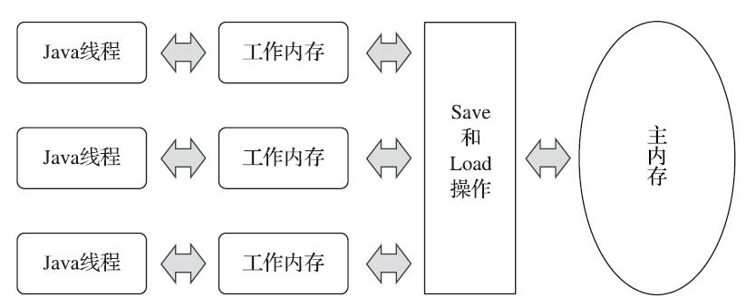
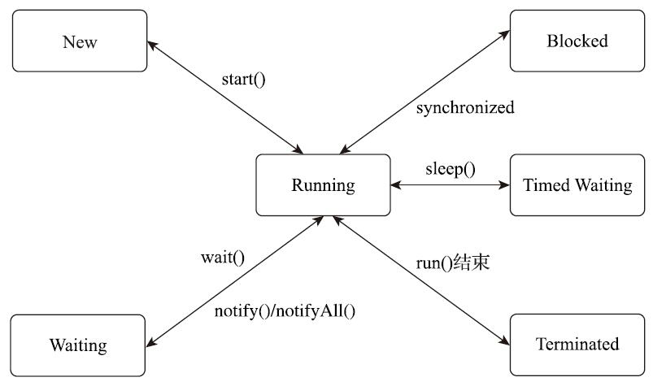
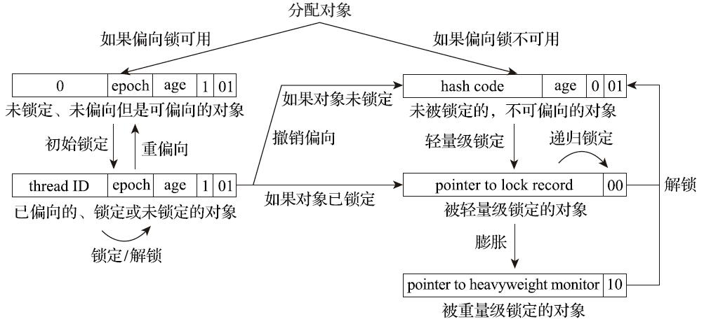

[TOC]

# 第 12 章 Java 内存模型与线程

## Java 内存模型

### 主内存与工作内存

Java 内存模型的**主要目的是定义程序中各种变量的访问规则**，<u>即关注在虚拟机中把变量值存储到内存和从内存中取出变量值这样的底层细节</u>。此处的变量(Variables)与Java编程中所说的变量有所区别，它包括了实例字段、静态字段和构成数组对象的元素，但是不包括局部变量与方法参数，因为后者是线程私有的，不会被共享，自然就不会存在竞争问题。

Java内存模型规定了所有的变量都存储在主内存(Main Memory)中（此处的主内存与介绍物理硬件时提到的主内存名字一样，两者也可以类比，但物理上它仅是虚拟机内存的一部分）。每条线程还有自己的工作内存（Working Memory，可与前面讲的处理器高速缓存类比），线程的工作内存中保存了被该线程使用的变量的主内存副本，线程对变量的所有操作（读取、赋值等）都必须在工作内存中进行，而不能直接读写主内存中的数据。不同的线程之间也无法直接访问对方工作内存中的变量，线程间变量值的传递均需要通过主内存来完成，线程、主内存、工作内存三者的交互关系如下图所示。

### 内存间交互操作

关于主内存与工作内存之间具体的交互协议，即一个变量如何从主内存拷贝到工作内存、如何从工作内存同步回主内存这一类的实现细节，Java内存模型中定义了以下8种操作来完成。

- lock（锁定）：作用于主内存的变量，它把一个变量标识为一条线程独占的状态。
- unlock（解锁）：作用于主内存的变量，它把一个处于锁定状态的变量释放出来，释放后的变量才可以被其他线程锁定。
- read（读取）：作用于主内存的变量，它把一个变量的值从主内存传输到线程的工作内存中，以便随后的 load 动作使用。
- load（载入）：作用于工作内存的变量，它把 read 操作从主内存中得到的变量值放入工作内存的变量副本中。
- use（使用）：作用于工作内存的变量，它把工作内存中一个变量的值传递给执行引擎，每当虚拟机遇到一个需要使用变量的值的字节码指令时将会执行这个操作。
- assign（赋值）：作用于工作内存的变量，它把一个从执行引擎接收的值赋给工作内存的变量，每当虚拟机遇到一个给变量赋值的字节码指令时执行这个操作。
- store（存储）：作用于工作内存的变量，它把工作内存中一个变量的值传送到主内存中，以便随后的 write 操作使用。
- write（写入）：作用于主内存的变量，它把 store 操作从工作内存中得到的变量的值放入主内存的变量中。

Java 内存模型要求 read 和 load、 store 和 write 必须按顺序执行，但不要求是连续执行。除此之外，Java内存模型还规定了在执行上述8种基本操作时必须满足如下规则：

- 不允许 read 和 load、store 和 write 操作之一单独出现，即不允许一个变量从主内存读取了但工作内存不接受，或者工作内存发起回写了但主内存不接受的情况出现。
- 不允许一个线程丢弃它最近的 assign 操作，即变量在工作内存中改变了之后必须把该变化同步回主内存。
- 不允许一个线程无原因地（没有发生过任何 assign 操作）把数据从线程的工作内存同步回主内存中。
- 一个新的变量只能在主内存中“诞生”，不允许在工作内存中直接使用一个未被初始化（load 或 assign）的变量，换句话说就是对一个变量实施 use、store 操作之前，必须先执行 assign 和 load 操作。
- 一个变量在同一个时刻只允许一条线程对其进行 lock 操作，但 lock 操作可以被同一条线程重复执行多次，多次执行 lock 后，只有执行相同次数的 unlock 操作，变量才会被解锁。
- **如果对一个变量执行 lock 操作，那将会清空工作内存中此变量的值**，在执行引擎使用这个变量前，需要重新执行 load 或 assign 操作以初始化变量的值。
- 如果一个变量事先没有被 lock 操作锁定，那就不允许对它执行 unlock 操作，也不允许去 unlock 一个被其他线程锁定的变量。
- **对一个变量执行 unlock 操作之前，必须先把此变量同步回主内存中（执行 store、write 操作）**。

### 对于 volatile 型变量的特殊规则

volatile 变量的两个语意：

1. 保证此变量对所有线程的可见性。
2. 禁止指令重排序优化。

### 针对 long 和 double 型变量的特殊规则

Java内存模型要求lock、unlock、read、load、assign、use、store、write这八种操作都具有原子性，但是对于 64 位的数据类型（long 和 double），在模型中特别定义了一条宽松的规定：允许虚拟机将没有被 volatile 修饰的 64 位数据的读写操作划分为两次 32 位的操作来进行，即允许虚拟机实现自行选择是否要保证 64 位数据类型的 load、store、read 和 write 这四个操作的原子性，这就是所谓的“long 和 double 的非原子性协定”（Non-Atomic Treatment of double and long Variables）。

### 原子性、可见性与有序性

1. **原子性（Atomicity）**

   由Java内存模型来直接保证的原子性变量操作包括 read、load、assign、use、store 和 write 这六个，我们**大致可以认为，基本数据类型的访问、读写都是具备原子性的**（例外就是long和double的非原子性协定，只要知道这件事情就可以了，无须太过在意这些几乎不会发生的例外情况）。

   如果应用场景需要一个更大范围的原子性保证（经常会遇到），Java内存模型还提供了 lock 和 unlock 操作来满足这种需求，尽管虚拟机未把 lock 和 unlock 操作直接开放给用户使用，但是却提供了更高层次的字节码指令 monitorenter 和 monitorexit 来隐式地使用这两个操作。这两个字节码指令反映到 Java 代码中就是同步块——synchronized 关键字，因此在synchronized块之间的操作也具备原子性。

2. **可见性（Visibility）**

   **可见性就是指当一个线程修改了共享变量的值时，其他线程能够立即得知这个修改。**

   对于 volatile 变量，Java 内存模型通过在变量修改后将新值同步回主内存，在变量读取前从主内存刷新变量值这种依赖主内存作为传递媒介的方式来实现可见性的，无论是普通变量还是 volatile 变量都是如此。

   <u>普通变量与 volatile 变量的区别是，volatile 的特殊规则保证了新值能立即同步到主内存，以及每次使用前立即从主内存刷新</u>。因此我们可以说 volatile 保证了多线程操作时变量的可见性，而普通变量则不能保证这一点。

   除了volatile之外，Java还有两个关键字能实现可见性，它们是 synchronized 和 final。同步块的可见性是由“对一个变量执行 unlock 操作之前，必须先把此变量同步回主内存中（执行 store、write 操作）”这条规则获得的。而 final 关键字的可见性是指：被 final 修饰的字段在构造器中一旦被初始化完成，并且构造器没有把“this”的引用传递出去（this 引用逃逸是一件很危险的事情，其他线程有可能通过这个引用访问到“初始化了一半”的对象），那么在其他线程中就能看见 final 字段的值。

3. **有序性（Ordering）**

   Java 程序中天然的有序性可以总结为一句话：**如果在本线程内观察，所有的操作都是有序的；如果在一个线程中观察另一个线程，所有的操作都是无序的。**前半句是指“线程内似表现为串行的语义”(Within-Thread As-If-Serial Semantics)，后半句是指“指令重排序”现象和“工作内存与主内存同步延迟”现象。

   Java语言提供了 volatile 和 synchronized 两个关键字来保证线程之间操作的有序性，volatile 关键字本身就包含了禁止指令重排序的语义，而 synchronized 则是由“一个变量在同一个时刻只允许一条线程对其进行 lock 操作”这条规则获得的，这个规则决定了持有同一个锁的两个同步块只能串行地进入。

### 先行发生原则（Happens-Before）

先行发生是 Java 内存模型中定义的两项操作之间的偏序关系，比如说操作 A 先行发生于操作 B，其实就是说在发生操作 B 之前，操作 A 产生的影响能被操作 B 观察到，“影响”包括修改了内存中共享变量的值、发送了消息、调用了方法等。

- **程序次序规则（Program Order Rule）**：在一个线程内，按照控制流顺序，书写在前面的操作先行发生于书写在后面的操作。注意，这里说的是控制流顺序而不是程序代码顺序，因为要考虑分支、循环等结构。
- **管程锁定规则（Monitor Lock Rule）**：一个 unlock 操作先行发生于后面对同一个锁的 lock 操作。这里必须强调的是“同一个锁”，而“后面”是指时间上的先后。
- **volatile 变量规则（Volatile Variable Rule）**：对一个 volatile 变量的写操作先行发生于后面对这个变量的读操作，这里的“后面”同样是指时间上的先后。
- **线程启动规则（Thread Start Rule）**：Thread 对象的 start() 方法先行发生于此线程的每一个动作。
- **线程终止规则（Thread Termination Rule）**：线程中的所有操作都先行发生于对此线程的终止检测，我们可以通过 Thread::join() 方法是否结束、Thread::isAlive() 的返回值等手段检测线程是否已经终止执行。
- **线程中断规则（Thread Interruption Rule）**：对线程 interrupt() 方法的调用先行发生于被中断线程的代码检测到中断事件的发生，可以通过 Thread::interrupted() 方法检测到是否有中断发生。
- **对象终结规则（Finalizer Rule）**：一个对象的初始化完成（构造函数执行结束）先行发生于它的 finalize() 方法的开始。
- **传递性（Transitivity）**：如果操作 A 先行发生于操作 B，操作 B 先行发生于操作 C，那就可以得出操作 A 先行发生于操作 C 的结论。

## Java 与线程

### 线程的实现

实现线程主要有三种方式：使用内核线程实现（1：1实现），使用用户线程实现（1：N实现），使用用户线程加轻量级进程混合实现（N：M实现）。

### Java 线程调度

调度主要方式有两种，分别是协同式(Cooperative Threads-Scheduling)线程调度和抢占式(Preemptive Threads-Scheduling)线程调度。

### 状态转换

Java 语言定义了 6 种线程状态：

- **新建（New）**：创建后尚未启动的线程处于此状态。
- **运行（Runnable）**：包括宝座系统线程状态中的 Running 和 Ready，也就是处于此状态的线程可能正在执行，也有可能正在等待着操作系统为它分配执行时间。
- **无限期等待（Waiting）**：处于这种状态的线程不会被分配处理器运行时间，它们要等待被其他线程显式唤醒。以下方法会让线程陷入无限期的等待状态：
  - 没有设置 Timeout 参数的 Object::wait() 方法；
  - 没有设置 Timeout 参数的 Thread::join() 方法；
  - LockSupport::park() 方法。

- **限期等待（Timed Waiting）**：处于这种状态的线程也不会被分配处理器执行时间，不过无须等待被其他线程显式唤醒，在一定时间之后它们会由系统自动唤醒。以下方法会让线程进入限期等待状态：
  - Thread::sleep() 方法；
  - 设置了 Timeout 参数的 Object::wait() 方法；
  - 设置了 Timeout 参数的 Thread::join() 方法；
  - LockSupport::parkNanos() 方法；
  - LockSupport::parkUntil() 方法。

- **阻塞（Blocked）**：线程被阻塞了，“阻塞状态”与“等待状态”的区别是“阻塞状态”在等待着获取到一个排它锁，这个事件将在另外一个线程放弃这个锁的时候发生；而“等待状态”则是在等待一段时间，或者唤醒动作的发生。在程序等待进入同步区域的时候，线程将进入这种状态。
- **结束（Terminated）**：已终止线程的线程状态，线程已经结束执行。

# 第 13 章 线程安全和锁优化

## 线程安全

《Java并发编程实战(Java Concurrency In Practice)》的作者 Brian Goetz 为“线程安全”做出了一个比较恰当的定义：“当多个线程同时访问一个对象时，如果不用考虑这些线程在运行时环境下的调度和交替执行，也不需要进行额外的同步，或者在调用方进行任何其他的协调操作，调用这个对象的行为都可以获得正确的结果，那就称这个对象是线程安全的。”

### Java 语言中的线程安全

按照线程安全的“安全程度”由强至弱来排序，可以将 Java 语言中各种操作共享的数据分为以下五类：不可变、绝对线程安全、相对线程安全、线程兼容和线程对立。

1. **不可变**

   在Java语言里面（特指 JDK 5 以后，即 Java 内存模型被修正之后的Java语言），不可变（Immutable）的对象一定是线程安全的，无论是对象的方法实现还是方法的调用者，都不需要再进行任何线程安全保障措施。

   Java语言中，如果多线程共享的数据是一个基本数据类型，那么只要在定义时使用final关键字修饰它就可以保证它是不可变的。如果共享数据是一个对象，由于Java语言目前暂时还没有提供值类型的支持，那就需要对象自行保证其行为不会对其状态产生任何影响才行。

   在Java类库API中符合不可变要求的类型，除了 String 之外，常用的还有枚举类型及 java.lang.Number 的部分子类，如 Long 和 Double 等数值包装类型、BigInteger 和 BigDecimal 等大数据类型。但同为 Number 子类型的原子类 AtomicInteger 和 AtomicLong 则是可变的，读者不妨看看这两个原子类的源码，想一想为什么它们要设计成可变的。

2. **绝对线程安全**

   绝对的线程安全能够完全满足Brian Goetz给出的线程安全的定义，这个定义其实是很严格的，一个类要达到“不管运行时环境如何，调用者都不需要任何额外的同步措施”可能需要付出非常高昂的，甚至不切实际的代价。

3. **相对线程安全**

   相对线程安全就是我们通常意义上所讲的线程安全，它需要保证对这个对象单次的操作是线程安全的，我们在调用的时候不需要进行额外的保障措施，但是对于一些特定顺序的连续调用，就可能需要在调用端使用额外的同步手段来保证调用的正确性。

4. **线程兼容**

   线程兼容是指对象本身并不是线程安全的，但是可以通过在调用端正确地使用同步手段来保证对象在并发环境中可以安全地使用。我们平常说一个类不是线程安全的，通常就是指这种情况。Java类库API中大部分的类都是线程兼容的，如ArrayList和HashMap等。

5. **线程对立**

   线程对立是指不管调用端是否采取了同步措施，都无法在多线程环境中并发使用代码。由于Java语言天生就支持多线程的特性，线程对立这种排斥多线程的代码是很少出现的，而且通常都是有害的，应当尽量避免。

   一个线程对立的例子是 Thread 类的 suspend() 和 resume() 方法。如果有两个线程同时持有一个线程对象，一个尝试去中断线程，一个尝试去恢复线程，在并发进行的情况下，无论调用时是否进行了同步，目标线程都存在死锁风险——假如 suspend() 中断的线程就是即将要执行 resume() 的那个线程，那就肯定要产生死锁了。也正是这个原因，suspend() 和 resume() 方法都已经被声明废弃了。常见的线程对立的操作还有 System.setIn()、Sytem.setOut() 和 System.runFinalizersOnExit() 等。

### 线程安全的实现方法

1. **互斥同步**

   互斥同步(Mutual Exclusion & Synchronization)是一种最常见也是最主要的并发正确性保障手段。同步是指在多个线程并发访问共享数据时，保证共享数据在同一个时刻只被一条（或者是一些，当使用信号量的时候）线程使用。而互斥是实现同步的一种手段，临界区(Critical Section)、互斥量(Mutex)和信号量(Semaphore)都是常见的互斥实现方式。因此在“互斥同步”这四个字里面，互斥是因，同步是果；互斥是方法，同步是目的。

   在 Java 中有 sunchronized 关键字和 ReentrantLock 等实现互斥同步的手段。

2. **非阻塞同步**

   互斥同步面临的主要问题是进行线程阻塞和唤醒所带来的性能开销，因此这种同步也被称为阻塞同步（Blocking Synchronization）。

   从解决问题的方式上看，互斥同步属于一种悲观的并发策略，其总是认为只要不去做正确的同步措施（例如加锁），那就肯定会出现问题，无论共享的数据是否真的会出现竞争，它都会进行加锁（这里讨论的是概念模型，实际上虚拟机会优化掉很大一部分不必要的加锁），这将会导致用户态到核心态转换、维护锁计数器和检查是否有被阻塞的线程需要被唤醒等开销。随着硬件指令集的发展，我们已经有了另外一个选择：基于冲突检测的乐观并发策略，通俗地说就是不管风险，先进行操作，如果没有其他线程争用共享数据，那操作就直接成功了；如果共享的数据的确被争用，产生了冲突，那再进行其他的补偿措施，最常用的补偿措施是不断地重试，直到出现没有竞争的共享数据为止。这种乐观并发策略的实现不再需要把线程阻塞挂起，因此这种同步操作被称为非阻塞同步(Non-Blocking Synchronization)，使用这种措施的代码也常被称为无锁(Lock-Free)编程。

   以 CAS 指令为例，CAS 指令需要有三个操作数，分别是内存位置（在Java中可以简单地理解为变量的内存地址，用V表示）、旧的预期值（用A表示）和准备设置的新值（用B表示）。CAS 指令执行时，当且仅当 V 符合 A 时，处理器才会用 B 更新 V 的值，否则它就不执行更新。但是，不管是否更新了 V 的值，都会返回 V 的旧值，上述的处理过程是一个原子操作，执行期间不会被其他线程中断。

   尽管 CAS 看起来很美好，既简单又高效，但显然这种操作无法涵盖互斥同步的所有使用场景，并且 CAS 从语义上来说并不是真正完美的，它存在一个逻辑漏洞：如果一个变量 V 初次读取的时候是 A 值，并且在准备赋值的时候检查到它仍然为 A 值，那就能说明它的值没有被其他线程改变过了吗？这是不能的，因为如果在这段期间它的值曾经被改成 B，后来又被改回为 A，那 CAS 操作就会误认为它从来没有被改变过。这个漏洞称为 CAS 操作的“**ABA 问题**”。J.U.C 包为了解决这个问题，提供了一个带有标记的原子引用类 AtomicStampedReference，它可以通过控制变量值的版本来保证 CAS 的正确性。不过目前来说这个类处于相当鸡肋的位置，大部分情况下 ABA 问题不会影响程序并发的正确性，如果需要解决 ABA 问题，改用传统的互斥同步可能会比原子类更为高效。

3. **无同步方案**

   要保证线程安全，也并非一定要进行阻塞或非阻塞同步，同步与线程安全两者没有必然的联系。同步只是保障存在共享数据争用时正确性的手段，<u>如果能让一个方法本来就不涉及共享数据，那它自然就不需要任何同步措施去保证其正确性</u>，因此会有一些代码天生就是线程安全的。

   **可重入代码(Reentrant Code)**：这种代码又称纯代码(Pure Code)，是指可以在代码执行的任何时刻中断它，转而去执行另外一段代码（包括递归调用它本身），而在控制权返回后，原来的程序不会出现任何错误，也不会对结果有所影响。在特指多线程的上下文语境里（不涉及信号量等因素），我们可以认为可重入代码是线程安全代码的一个真子集，这意味着相对线程安全来说，可重入性是更为基础的特性，它可以保证代码线程安全，即所有可重入的代码都是线程安全的，但并非所有的线程安全的代码都是可重入的。

   可重入代码有一些共同的特征，例如，不依赖全局变量、存储在堆上的数据和公用的系统资源，用到的状态量都由参数中传入，不调用非可重入的方法等。我们可以通过一个比较简单的原则来判断代码是否具备可重入性：如果一个方法的返回结果是可以预测的，只要输入了相同的数据，就都能返回相同的结果，那它就满足可重入性的要求，当然也就是线程安全的。

   **线程本地存储(Thread Local Storage)**：如果一段代码中所需要的数据必须与其他代码共享，那就看看这些共享数据的代码是否能保证在同一个线程中执行。如果能保证，我们就可以把共享数据的可见范围限制在同一个线程之内，这样，无须同步也能保证线程之间不出现数据争用的问题。

## 锁优化

### 自旋锁和自适应自旋

让请求锁的线程执行忙循环（自旋），但不放弃处理器的执行时间，看持有锁的线程是否很快就会释放锁，这项就是所谓的自旋。

如果锁被占用的时间很短，自旋等待的效果就会非常好，反之如果锁被占用的时间很长，那么自旋的线程只会白白消耗处理器资源，而不会做任何有价值的工作，这就会带来性能的浪费。因此自旋等待的时间必须有一定的限度，如果自旋超过了限定的次数仍然没有成功获得锁，就应当使用传统的方式去挂起线程。自旋次数的默认值是十次，用户也可以使用参数-XX：PreBlockSpin来自行更改。

在JDK 6中对自旋锁的优化，引入了自适应的自旋。自适应意味着自旋的时间不再是固定的了，而是由前一次在同一个锁上的自旋时间及锁的拥有者的状态来决定的。如果在同一个锁对象上，自旋等待刚刚成功获得过锁，并且持有锁的线程正在运行中，那么虚拟机就会认为这次自旋也很有可能再次成功，进而允许自旋等待持续相对更长的时间，比如持续100次忙循环。另一方面，如果对于某个锁，自旋很少成功获得过锁，那在以后要获取这个锁时将有可能直接省略掉自旋过程，以避免浪费处理器资源。

### 锁消除

锁消除是指虚拟机即时编译器在运行时，对一些代码要求同步，但是对被检测到不可能存在共享数据竞争的锁进行消除。锁消除的主要判定依据来源于逃逸分析的数据支持，如果判断到一段代码中，在堆上的所有数据都不会逃逸出去被其他线程访问到，那就可以把它们当作栈上数据对待，认为它们是线程私有的，同步加锁自然就无须再进行。

### 锁粗化

如果一系列的连续操作都对同一个对象反复加锁和解锁，甚至加锁操作是出现在循环体之中的，那即使没有线程竞争，频繁地进行互斥同步操作也会导致不必要的性能损耗。

如果虚拟机探测到有这样一串零碎的操作都对同一个对象加锁，将会把加锁同步的范围扩展（粗化）到整个操作序列的外部，这样只需要加锁一次就可以了。

### 轻量级锁

轻量级锁是JDK 6时加入的新型锁机制，它名字中的“轻量级”是相对于使用操作系统互斥量来实现的传统锁而言的，因此传统的锁机制就被称为“重量级”锁。不过，需要强调一点，轻量级锁并不是用来代替重量级锁的，它设计的初衷是在没有多线程竞争的前提下，减少传统的重量级锁使用操作系统互斥量产生的性能消耗。

**轻量级锁的工作过程：**

1. **加锁**

   在代码即将进入同步块的时候，如果此同步对象没有被锁定（锁标志位为“01”状态），虚拟机首先将在当前线程的栈帧中建立一个名为锁记录(Lock Record)的空间，用于存储锁对象目前的Mark Word的拷贝（官方为这份拷贝加了一个Displaced前缀，即Displaced Mark Word）。

   然后，虚拟机将使用CAS操作尝试把对象的Mark Word更新为指向Lock Record的指针。如果这个更新动作成功了，即代表该线程拥有了这个对象的锁，并且对象Mark Word的锁标志位（Mark Word的最后两个比特）将转变为“00”，表示此对象处于轻量级锁定状态。

   如果这个更新操作失败了，那就意味着至少存在一条线程与当前线程竞争获取该对象的锁。虚拟机首先会检查对象的Mark Word是否指向当前线程的栈帧，如果是，说明当前线程已经拥有了这个对象的锁，那直接进入同步块继续执行就可以了，否则就说明这个锁对象已经被其他线程抢占了。如果出现两条以上的线程争用同一个锁的情况，那轻量级锁就不再有效，必须要膨胀为重量级锁，锁标志的状态值变为“10”，此时Mark Word中存储的就是指向重量级锁（互斥量）的指针，后面等待锁的线程也必须进入阻塞状态。

2. **解锁**

   如果对象的Mark Word仍然指向线程的锁记录，那就用CAS操作把对象当前的Mark Word和线程中复制的Displaced Mark Word替换回来。假如能够成功替换，那整个同步过程就顺利完成了；如果替换失败，则说明有其他线程尝试过获取该锁，就要在释放锁的同时，唤醒被挂起的线程。

### 偏向锁

偏向锁也是JDK 6中引入的一项锁优化措施，它的目的是消除数据在无竞争情况下的同步原语，进一步提高程序的运行性能。如果说轻量级锁是在无竞争的情况下使用CAS操作去消除同步使用的互斥量，那偏向锁就是在无竞争的情况下把整个同步都消除掉，连CAS操作都不去做了。

假设当前虚拟机启用了偏向锁（启用参数-XX：+UseBiased Locking，这是自JDK 6起HotSpot虚拟机的默认值），那么当锁对象第一次被线程获取的时候，虚拟机将会把对象头中的标志位设置为“01”、把偏向模式设置为“1”，表示进入偏向模式。同时使用CAS操作把获取到这个锁的线程的ID记录在对象的Mark Word之中。如果CAS操作成功，持有偏向锁的线程以后每次进入这个锁相关的同步块时，虚拟机都可以不再进行任何同步操作（例如加锁、解锁及对Mark Word的更新操作等）。

一旦出现另外一个线程去尝试获取这个锁的情况，偏向模式就马上宣告结束。根据锁对象目前是否处于被锁定的状态决定是否撤销偏向（偏向模式设置为“0”），撤销后标志位恢复到未锁定（标志位为“01”）或轻量级锁定（标志位为“00”）的状态，后续的同步操作就按照上面介绍的轻量级锁那样去执行。

**偏向锁、轻量级锁的状态转化及对象Mark Word的关系**

当对象进入偏向状态的时候，Mark Word大部分的空间（23个比特）都用于存储持有锁的线程ID了，这部分空间占用了原有存储对象哈希码的位置，那原来对象的哈希码怎么办呢？

在Java语言里面一个对象如果计算过哈希码，就应该一直保持该值不变（强烈推荐但不强制，因为用户可以重载hashCode()方法按自己的意愿返回哈希码），否则很多依赖对象哈希码的API都可能存在出错风险。而作为绝大多数对象哈希码来源的Object::hashCode()方法，返回的是对象的一致性哈希码(Identity Hash Code)，这个值是能强制保证不变的，它通过在对象头中存储计算结果来保证第一次计算之后，再次调用该方法取到的哈希码值永远不会再发生改变。因此，**当一个对象已经计算过一致性哈希码后，它就再也无法进入偏向锁状态了；而当一个对象当前正处于偏向锁状态，又收到需要计算其一致性哈希码请求时，它的偏向状态会被立即撤销，并且锁会膨胀为重量级锁。**在重量级锁的实现中，对象头指向了重量级锁的位置，代表重量级锁的ObjectMonitor类里有字段可以记录非加锁状态（标志位为“01”）下的Mark Word，其中自然可以存储原来的哈希码。
